# Comprehensive Prompt System Documentation

<cite>
**Referenced Files in This Document**
- [prompts.md](file://docs/prompts.md)
- [generation.py](file://agents/generation.py)
- [assembly.py](file://agents/assembly.py)
- [validation.py](file://agents/validation.py)
- [privacy.py](file://agents/privacy.py)
- [worker.py](file://agents/worker.py)
- [resume_parser.py](file://backend/app/services/resume_parser.py)
- [workflow.py](file://backend/app/services/workflow.py)
- [workflow-contract.json](file://shared/workflow-contract.json)
- [pdf_export.py](file://backend/app/services/pdf_export.py)
- [internal_worker.py](file://backend/app/api/internal_worker.py)
- [test_worker.py](file://agents/tests/test_worker.py)
- [application_manager.py](file://backend/app/services/application_manager.py)
</cite>

## Update Summary
**Changes Made**
- Updated extraction callback resilience documentation to reflect best-effort callback behavior
- Added documentation for enhanced extraction reliability measures
- Updated callback error handling and recovery mechanisms
- Enhanced extraction job continuation logic when callbacks fail

## Table of Contents
1. [Introduction](#introduction)
2. [Project Structure](#project-structure)
3. [Core Components](#core-components)
4. [Architecture Overview](#architecture-overview)
5. [Detailed Component Analysis](#detailed-component-analysis)
6. [Dependency Analysis](#dependency-analysis)
7. [Performance Considerations](#performance-considerations)
8. [Troubleshooting Guide](#troubleshooting-guide)
9. [Conclusion](#conclusion)

## Introduction

The AI Prompt System is a sophisticated, multi-agent architecture designed to generate, validate, and assemble professional resumes with strict adherence to Anti-Tracking Safety (ATS) compliance and privacy protection. This system operates as a single-call generation pipeline that produces structured JSON output, which is then validated locally and assembled deterministically.

The system maintains four distinct prompt families: Job Posting Extraction, Resume Generation (full and single-section), and Resume Upload Cleanup. Each prompt family is carefully crafted to ensure that sensitive personal information remains protected while producing high-quality, ATS-optimized content.

**Updated** Enhanced extraction reliability with best-effort callback behavior and improved error recovery mechanisms.

## Project Structure

The prompt system spans three main architectural layers:

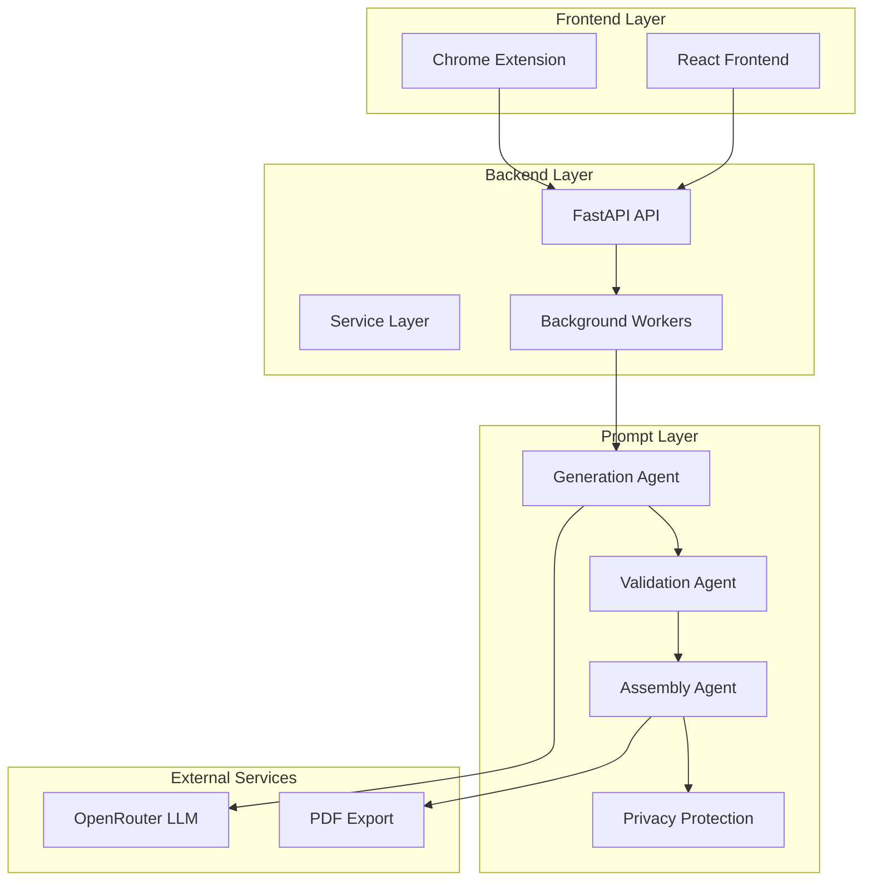

**Diagram sources**
- [internal_worker.py:1-71](file://backend/app/api/internal_worker.py#L1-L71)
- [worker.py:1-800](file://agents/worker.py#L1-L800)
- [generation.py:1-596](file://agents/generation.py#L1-L596)

**Section sources**
- [prompts.md:1-199](file://docs/prompts.md#L1-L199)
- [workflow-contract.json:1-114](file://shared/workflow-contract.json#L1-L114)

## Core Components

### Prompt Families and Variants

The system defines four primary prompt families, each serving specific use cases:

#### Job Posting Extraction Prompt
- **Purpose**: Extract structured job posting fields from captured webpage context
- **Constraints**: No invented facts, requires job_title and job_description
- **Origin Normalization**: Supports 8 predefined sources (LinkedIn, Indeed, Google Jobs, Glassdoor, ZipRecruiter, Monster, Dice, Company Website)
- **Enhanced Reliability**: Best-effort callback delivery with automatic continuation when backend is unreachable
- **Runtime Enforcement**: Structured output validation with comprehensive field requirements

#### Resume Generation Prompts
- **Shared System Prompt**: Base template used for both full-draft and single-section generation
- **Operation Variants**: Generation, Full Regeneration, Section Regeneration
- **Aggressiveness Levels**: Low (conservative), Medium (balanced), High (assertive)
- **Target Length Profiles**: 1-page, 2-page, 3-page optimization

#### Single-Section Regeneration Prompt
- **Scope**: Focuses on regenerating individual resume sections
- **Constraint**: Returns JSON shaped as {"section": {...}}

#### Resume Upload Cleanup Prompt
- **Purpose**: Improve Markdown structure of parsed resume content
- **Constraint**: Preserves substance, removes contact data, maintains formatting

**Section sources**
- [prompts.md:13-199](file://docs/prompts.md#L13-L199)
- [generation.py:19-44](file://agents/generation.py#L19-L44)

### Prompt Construction Architecture

The system employs a hierarchical prompt construction approach:

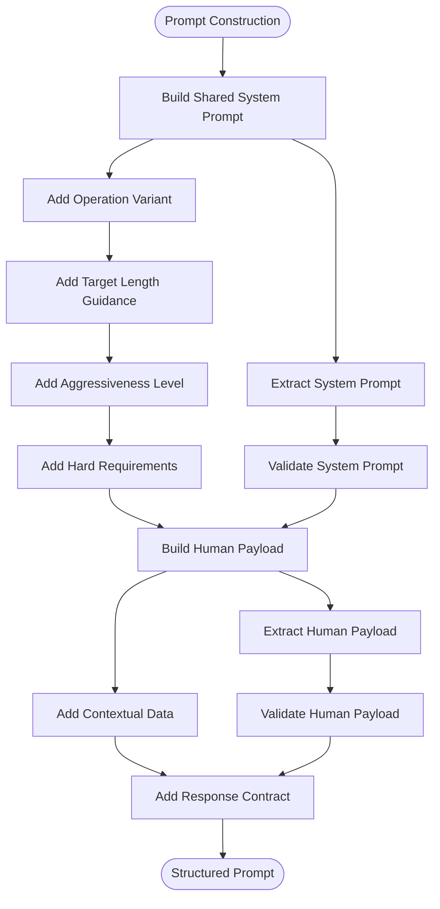

**Diagram sources**
- [generation.py:268-385](file://agents/generation.py#L268-L385)

**Section sources**
- [generation.py:268-385](file://agents/generation.py#L268-L385)

## Architecture Overview

The prompt system follows a single-call generation architecture that prioritizes privacy and deterministic validation:

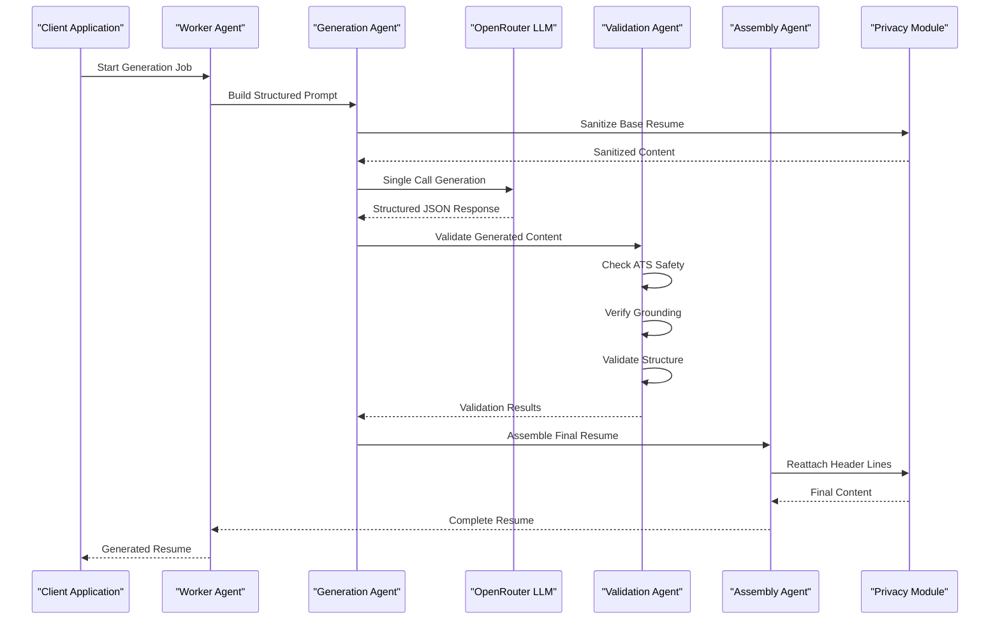

**Diagram sources**
- [worker.py:780-800](file://agents/worker.py#L780-L800)
- [generation.py:454-596](file://agents/generation.py#L454-L596)
- [validation.py:445-511](file://agents/validation.py#L445-L511)
- [assembly.py:20-71](file://agents/assembly.py#L20-L71)

The architecture ensures that:
- All resume content passes through privacy sanitization before external LLM calls
- Generation occurs in a single model call to reduce latency and costs
- Validation happens locally with deterministic rules
- Assembly maintains proper header separation and formatting

**Section sources**
- [prompts.md:3-7](file://docs/prompts.md#L3-L7)
- [decisions-made-1.md:1-13](file://docs/decisions-made/decisions-made-1.md#L1-L13)

## Detailed Component Analysis

### Generation Agent Architecture

The Generation Agent serves as the central orchestrator for all resume creation activities:

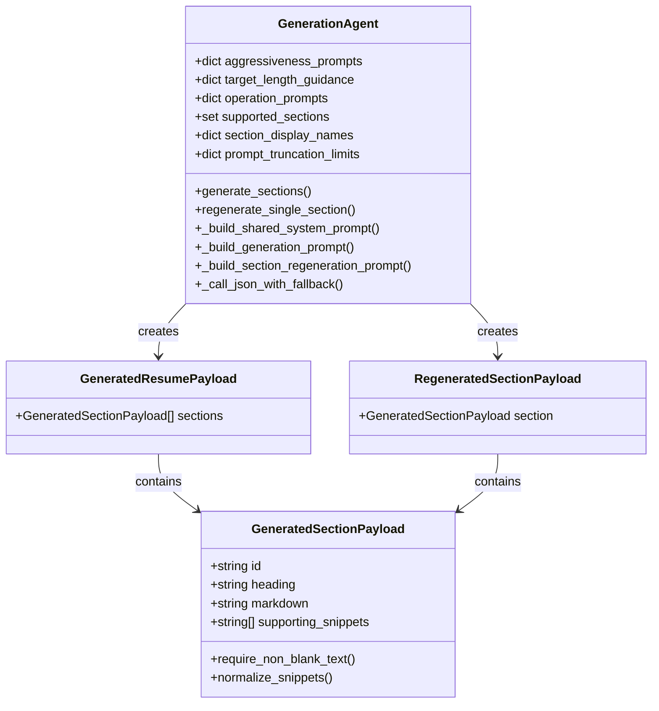

**Diagram sources**
- [generation.py:62-91](file://agents/generation.py#L62-L91)
- [generation.py:454-596](file://agents/generation.py#L454-L596)

#### Prompt Construction Methods

The Generation Agent implements sophisticated prompt construction with runtime permutation capabilities:

| Method | Purpose | Input Parameters |
|--------|---------|------------------|
| `_build_shared_system_prompt` | Creates base system prompt template | operation, enabled_sections, aggressiveness, target_length |
| `_build_generation_prompt` | Builds full-draft generation prompt | base_resume_content, job_title, company_name, job_description |
| `_build_section_regeneration_prompt` | Creates single-section regeneration prompt | section_name, instructions, current_section_content |

#### Response Normalization Pipeline

The system includes robust response normalization to handle diverse LLM outputs:

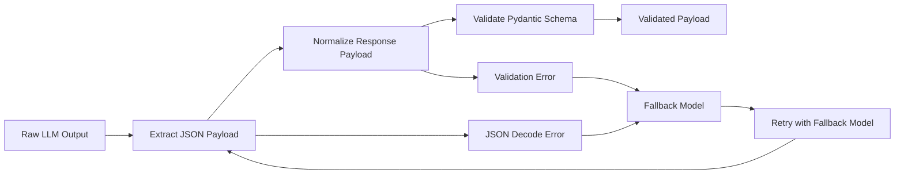

**Diagram sources**
- [generation.py:388-441](file://agents/generation.py#L388-L441)

**Section sources**
- [generation.py:62-91](file://agents/generation.py#L62-L91)
- [generation.py:268-385](file://agents/generation.py#L268-L385)

### Validation Agent Implementation

The Validation Agent performs comprehensive local validation with deterministic rules:

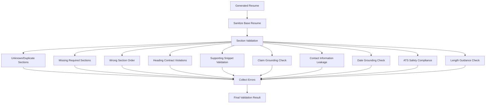

**Diagram sources**
- [validation.py:445-511](file://agents/validation.py#L445-L511)

#### Validation Categories

| Validation Type | Purpose | Detection Mechanism |
|----------------|---------|---------------------|
| Section Validation | Ensures all enabled sections are present | Compare enabled vs generated sections |
| ATS Safety | Prevents HTML, tables, images, code fences | Regex pattern matching |
| Grounding Validation | Verifies claims exist in base resume | Text search and normalization |
| Contact Leakage | Prevents personal information exposure | Email, phone, URL pattern detection |
| Length Compliance | Enforces target length limits | Word count calculation |

**Section sources**
- [validation.py:148-222](file://agents/validation.py#L148-L222)
- [validation.py:295-350](file://agents/validation.py#L295-L350)

### Privacy Protection System

The Privacy Protection system ensures sensitive information never leaves the application boundary:

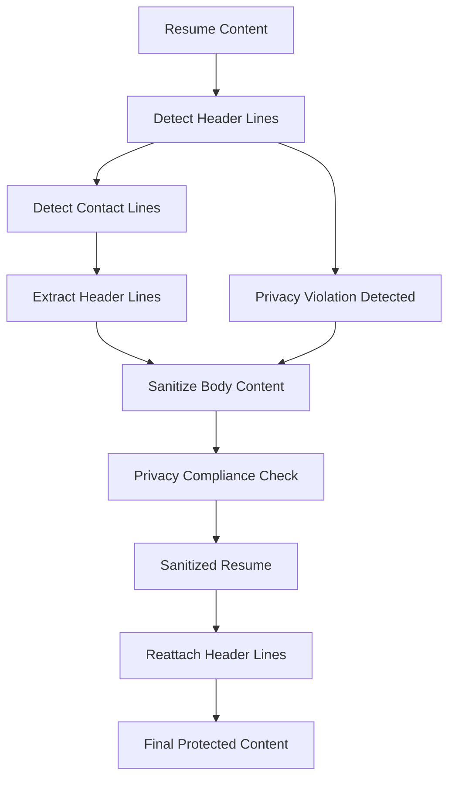

**Diagram sources**
- [privacy.py:118-173](file://agents/privacy.py#L118-L173)

#### Privacy Detection Patterns

| Pattern Category | Detection Method | Examples |
|------------------|------------------|----------|
| Email Addresses | Regex pattern matching | user@example.com |
| Phone Numbers | Complex phone number regex | (555) 123-4567 |
| URLs | URL pattern detection | linkedin.com/github.com |
| Contact Markers | Keyword matching | email:, phone:, address: |
| Section Headings | Common section detection | SUMMARY, EXPERIENCE, EDUCATION |

**Section sources**
- [privacy.py:6-37](file://agents/privacy.py#L6-L37)
- [privacy.py:118-173](file://agents/privacy.py#L118-L173)

### Workflow Management

The system manages complex workflows through a contract-driven approach:

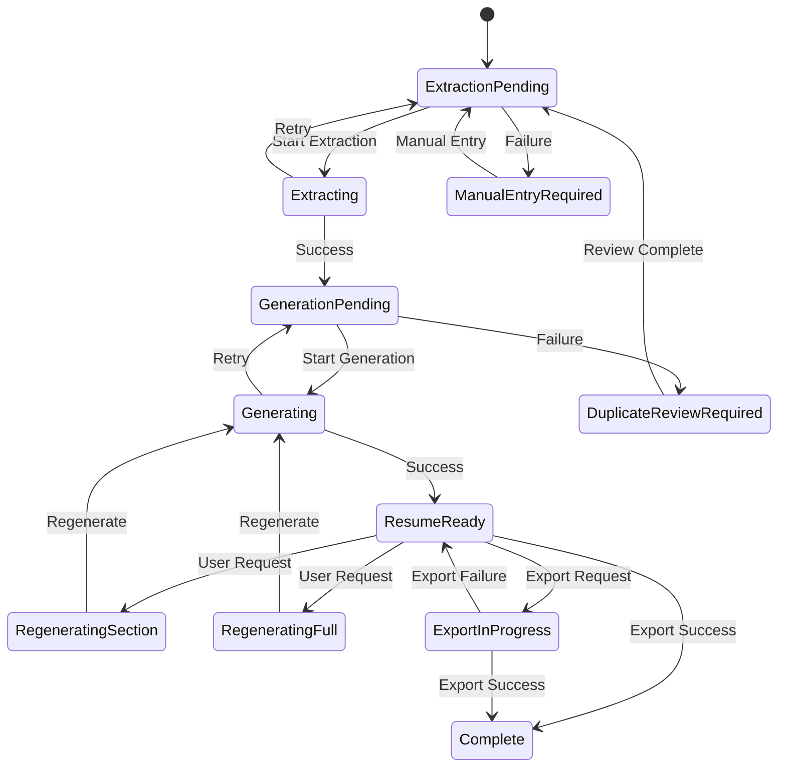

**Diagram sources**
- [workflow-contract.json:9-29](file://shared/workflow-contract.json#L9-L29)
- [workflow.py:11-32](file://backend/app/services/workflow.py#L11-L32)

**Section sources**
- [workflow-contract.json:1-114](file://shared/workflow-contract.json#L1-L114)
- [workflow.py:1-32](file://backend/app/services/workflow.py#L1-L32)

### Extraction Callback Resilience

**Updated** The extraction system now implements best-effort callback delivery with enhanced reliability:

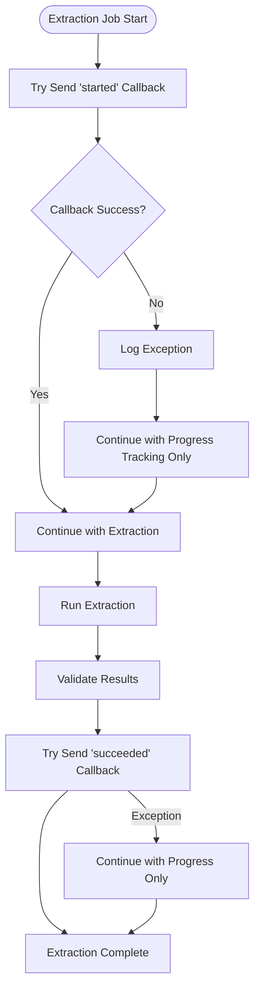

**Diagram sources**
- [worker.py:696-711](file://agents/worker.py#L696-L711)
- [worker.py:705-710](file://agents/worker.py#L705-L710)

#### Callback Error Handling

The extraction system implements comprehensive error handling for callback failures:

| Scenario | Behavior | Recovery Mechanism |
|----------|----------|-------------------|
| Started callback fails | Log exception and continue | Progress tracking via Redis only |
| Succeeded callback fails | Continue with extraction completion | Terminal callback for reconciliation |
| Backend unreachable | Best-effort delivery with retries | Eventual state convergence via Redis |
| Network errors | Automatic retry with exponential backoff | Fallback to progress-only tracking |

**Section sources**
- [worker.py:696-711](file://agents/worker.py#L696-L711)
- [worker.py:705-710](file://agents/worker.py#L705-L710)
- [test_worker.py:273-337](file://agents/tests/test_worker.py#L273-L337)

## Dependency Analysis

The prompt system exhibits well-managed dependencies with clear separation of concerns:

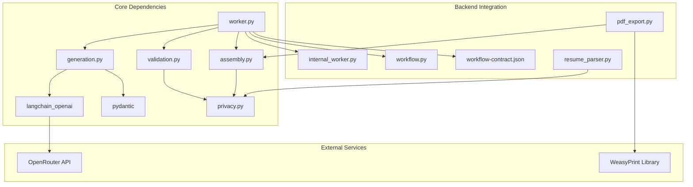

**Diagram sources**
- [generation.py:14-17](file://agents/generation.py#L14-L17)
- [worker.py:21-23](file://agents/worker.py#L21-L23)
- [resume_parser.py:10-24](file://backend/app/services/resume_parser.py#L10-L24)

### Component Coupling Analysis

| Component | Cohesion Score | Coupling Factor | External Dependencies |
|-----------|----------------|-----------------|----------------------|
| Generation Agent | High (9/10) | Medium (5/10) | 2 external libraries |
| Validation Agent | High (8/10) | Low (3/10) | 1 internal dependency |
| Privacy Module | High (9/10) | Very Low (2/10) | 0 external dependencies |
| Assembly Agent | High (8/10) | Low (3/10) | 1 internal dependency |
| Worker Orchestrator | Medium (6/10) | High (7/10) | 4 external integrations |
| **Extraction Callback System** | **High (9/10)** | **Medium (6/10)** | **1 external integration** |

**Section sources**
- [generation.py:1-596](file://agents/generation.py#L1-L596)
- [validation.py:1-511](file://agents/validation.py#L1-L511)
- [privacy.py:1-173](file://agents/privacy.py#L1-L173)
- [assembly.py:1-71](file://agents/assembly.py#L1-L71)

## Performance Considerations

### Prompt Budget Management

The system implements aggressive prompt truncation to manage token budgets:

| Content Type | Truncation Limit | Rationale |
|-------------|------------------|-----------|
| Job Description | 16,000 characters | Prevents context overflow |
| Base Resume | 16,000 characters | Maintains grounding quality |
| Current Section | 6,000 characters | Enables focused regeneration |

### Model Call Optimization

The single-call architecture reduces latency and costs:
- **Generation Calls**: 1 call per job (vs 4+ calls in previous architecture)
- **Fallback Strategy**: Automatic fallback to secondary model on failure
- **Timeout Management**: Bounded timeouts (30-45 seconds) prevent resource exhaustion

### Memory Management

The system employs efficient memory handling:
- **Streaming Processing**: Large documents processed in chunks
- **Content Normalization**: Reduces redundant whitespace and formatting
- **Sanitization Pipeline**: Removes unnecessary content before LLM processing

### Extraction Reliability Improvements

**Updated** Enhanced extraction reliability through best-effort callback delivery:

- **Callback Resilience**: Extraction continues even when callback endpoints are temporarily unreachable
- **Progress Tracking**: Redis-based progress monitoring ensures state consistency
- **Terminal Recovery**: Backend reconciliation handles eventual callback delivery
- **Error Classification**: Specific failure types for extraction callback delivery issues

**Section sources**
- [prompts.md:336-345](file://docs/prompts.md#L336-L345)
- [worker.py:696-711](file://agents/worker.py#L696-L711)

## Troubleshooting Guide

### Common Prompt Issues

| Issue | Symptoms | Resolution |
|-------|----------|------------|
| JSON Parsing Failure | ValidationError during response processing | Check response contract format |
| Privacy Violation | Contact information leakage detected | Review privacy sanitization steps |
| ATS Violation | HTML, tables, or images in output | Apply ATS safety validation |
| Grounding Failure | Unsupported claims or dates | Verify base resume content |
| Timeout Error | Generation exceeds timeout limits | Reduce content size or adjust settings |
| **Extraction Callback Failure** | **Started callback exception logged** | **Best-effort continuation with progress tracking** |

### Debugging Strategies

1. **Prompt Inspection**: Examine constructed prompts in generation agent
2. **Privacy Audit**: Verify sanitization results before LLM calls
3. **Validation Trace**: Check validation error categories and severity
4. **Workflow State**: Monitor internal state transitions in workflow manager
5. **Callback Monitoring**: Check extraction callback delivery logs and Redis progress

### Error Recovery Patterns

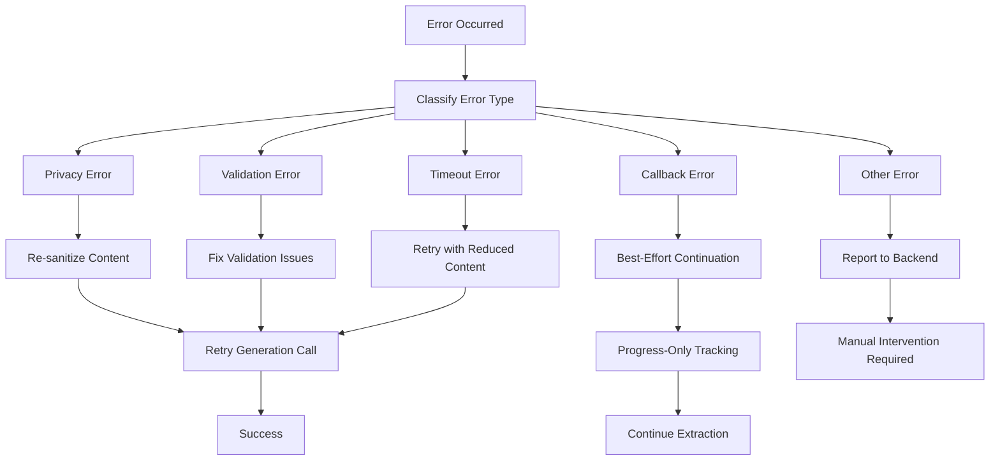

**Updated** Enhanced callback error recovery with best-effort continuation:

- **Started Callback Failure**: Extraction continues with progress-only tracking
- **Succeeded Callback Failure**: Backend reconciliation handles eventual delivery
- **Network Transients**: Automatic retry with exponential backoff
- **Eventual Consistency**: Redis progress ensures state convergence

**Section sources**
- [generation.py:388-441](file://agents/generation.py#L388-L441)
- [validation.py:445-511](file://agents/validation.py#L445-L511)
- [worker.py:696-711](file://agents/worker.py#L696-L711)
- [test_worker.py:273-337](file://agents/tests/test_worker.py#L273-L337)

## Conclusion

The Comprehensive Prompt System represents a mature, production-ready architecture for AI-powered resume generation. Its strength lies in the careful balance between flexibility and safety, enabling sophisticated customization while maintaining strict privacy and ATS compliance guarantees.

Key architectural achievements include:
- **Privacy-First Design**: All resume content remains within application boundaries
- **Deterministic Validation**: Local validation eliminates external dependencies
- **Single-Call Efficiency**: Reduced latency and costs through optimized architecture
- **Runtime Flexibility**: Dynamic section permutations and parameter variations
- **Robust Error Handling**: Comprehensive fallback mechanisms and recovery strategies
- **Enhanced Extraction Reliability**: Best-effort callback delivery with automatic continuation

**Updated** Recent improvements focus on extraction callback resilience, ensuring system reliability even when backend communication is temporarily unavailable. The addition of best-effort callback behavior provides graceful degradation while maintaining eventual consistency through Redis-based progress tracking.

The system's modular design facilitates future enhancements while maintaining backward compatibility. The extensive documentation and testing infrastructure support ongoing development and maintenance efforts.