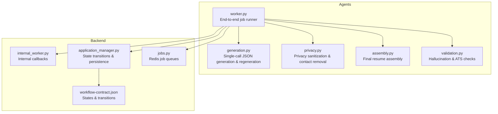
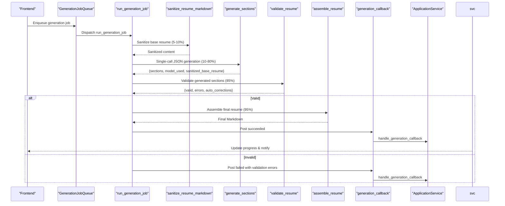
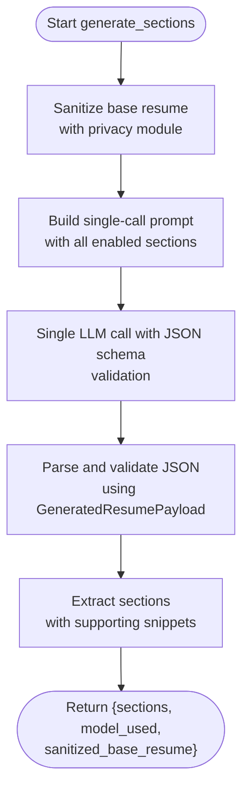
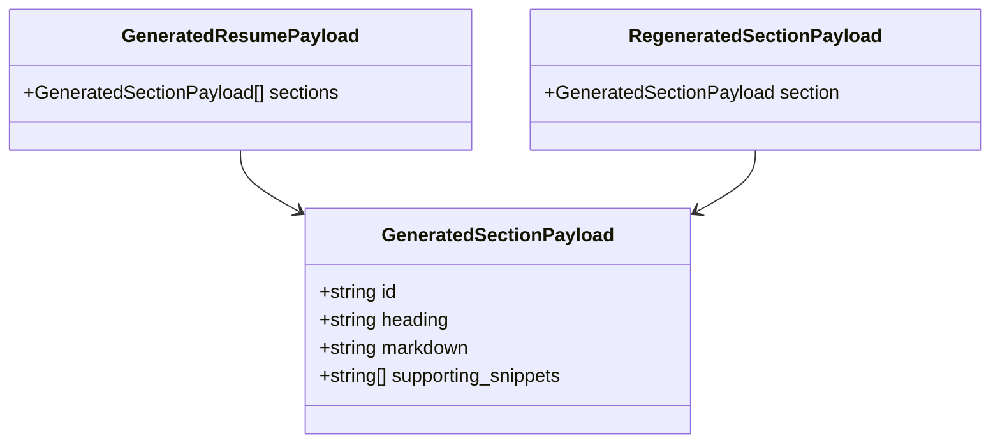
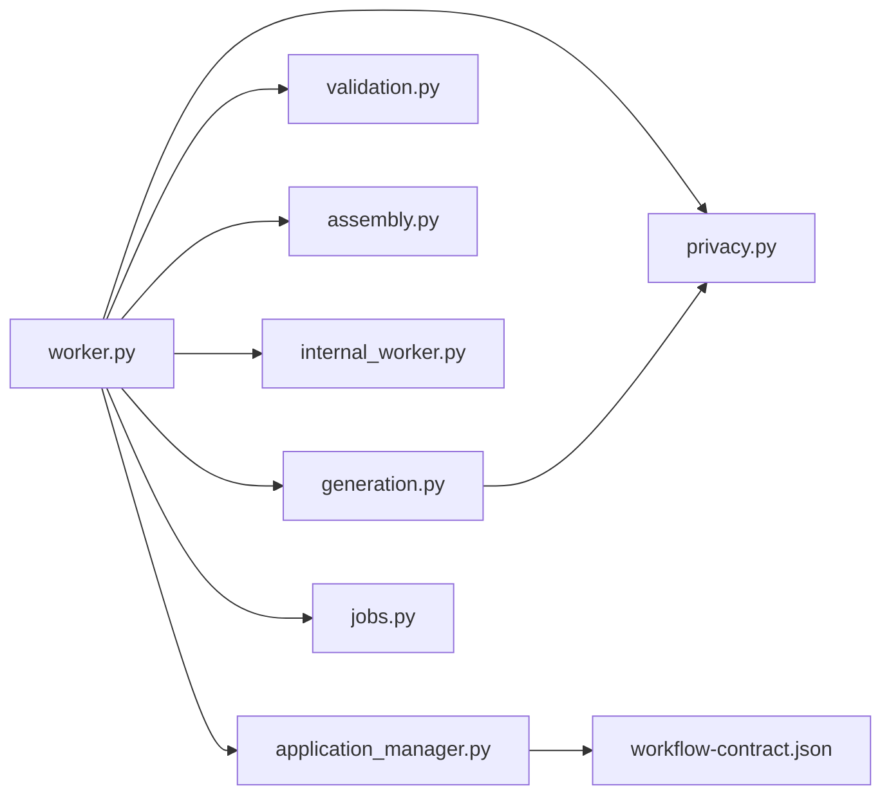

# Generation Agent

<cite>
**Referenced Files in This Document**
- [generation.py](file://agents/generation.py)
- [assembly.py](file://agents/assembly.py)
- [validation.py](file://agents/validation.py)
- [worker.py](file://agents/worker.py)
- [privacy.py](file://agents/privacy.py)
- [internal_worker.py](file://backend/app/api/internal_worker.py)
- [application_manager.py](file://backend/app/services/application_manager.py)
- [jobs.py](file://backend/app/services/jobs.py)
- [workflow-contract.json](file://shared/workflow-contract.json)
- [prompts.md](file://docs/prompts.md)
- [AGENTS.md](file://agents/AGENTS.md)
</cite>

## Update Summary
**Changes Made**
- Complete architectural transformation from section-by-section generation to single-call structured JSON generation system
- New Pydantic models (GeneratedSectionPayload, GeneratedResumePayload, RegeneratedSectionPayload) replace individual section generation
- Privacy sanitization integrated directly into generation process using privacy.py module
- Extensive prompt catalog documentation in docs/prompts.md covering all prompt variants
- Updated workflow to generate all enabled sections in a single LLM call
- Enhanced validation with supporting snippets and grounding requirements

## Table of Contents
1. [Introduction](#introduction)
2. [Project Structure](#project-structure)
3. [Core Components](#core-components)
4. [Architecture Overview](#architecture-overview)
5. [Detailed Component Analysis](#detailed-component-analysis)
6. [Dependency Analysis](#dependency-analysis)
7. [Performance Considerations](#performance-considerations)
8. [Troubleshooting Guide](#troubleshooting-guide)
9. [Conclusion](#conclusion)

## Introduction
This document explains the generation agent responsible for AI-powered, single-call structured JSON resume creation. The system has undergone a major architectural transformation from section-by-section generation to a unified approach that generates all enabled sections in a single LLM call using Pydantic models. It covers:
- Single-call structured JSON generation using GeneratedResumePayload and RegeneratedSectionPayload models
- Integrated privacy sanitization using privacy.py module with comprehensive contact data removal
- Prompt engineering strategies with extensive documentation in docs/prompts.md
- Structured output validation with supporting snippets and grounding requirements
- Section preferences and ordering with dynamic permutation support
- Integration with LangChain for reliable, structured LLM responses
- Regeneration capabilities for full drafts and individual sections
- Assembly of final Markdown using personal info and generated sections
- Model configuration, fallback handling, and progress reporting
- Validation to prevent hallucinations and ensure ATS-safe output
- Context-aware generation using base resume content and job posting details

## Project Structure
The generation agent spans three layers with a streamlined architecture:
- Agents orchestrating AI workflows with single-call generation
- Backend API and services coordinating jobs and callbacks
- Shared workflow contract defining states and transitions

**Diagram sources**
- [generation.py:1-596](file://agents/generation.py#L1-L596)
- [privacy.py:1-173](file://agents/privacy.py#L1-L173)
- [assembly.py:1-71](file://agents/assembly.py#L1-L71)
- [validation.py:1-511](file://agents/validation.py#L1-L511)
- [worker.py:1-200](file://agents/worker.py#L1-L200)
- [internal_worker.py:1-71](file://backend/app/api/internal_worker.py#L1-L71)
- [application_manager.py:603-799](file://backend/app/services/application_manager.py#L603-L799)
- [jobs.py:1-138](file://backend/app/services/jobs.py#L1-L138)
- [workflow-contract.json:1-112](file://shared/workflow-contract.json#L1-L112)

**Section sources**
- [AGENTS.md:1-100](file://AGENTS.md#L1-L100)

## Core Components
- **Single-call structured generation**:
  - Generates all enabled sections in a single LLM call using GeneratedResumePayload
  - Uses privacy-sanitized base resume content with integrated contact removal
  - Employs Pydantic models for strict JSON schema validation
  - Supports three aggressiveness levels: low, medium, and high
  - Supports three target length options: 1_page, 2_page, and 3_page
- **Privacy sanitization integration**:
  - Direct integration with privacy.py module for contact data removal
  - Comprehensive sanitization of personal information before generation
  - Maintains header lines separately for later reattachment
- **Enhanced validation**:
  - Validates supporting snippets for grounding claims
  - Checks section ordering and metadata consistency
  - Ensures ATS-safe content with auto-corrections
- **Assembly and regeneration**:
  - Combines personal info header with ordered generated sections
  - Supports single-section regeneration with context preservation
  - Maintains section display names and ordering consistency

**Section sources**
- [generation.py:62-91](file://agents/generation.py#L62-L91)
- [generation.py:454-596](file://agents/generation.py#L454-L596)
- [privacy.py:118-173](file://agents/privacy.py#L118-L173)
- [validation.py:445-511](file://agents/validation.py#L445-L511)
- [assembly.py:20-71](file://agents/assembly.py#L20-L71)

## Architecture Overview
The generation agent follows a streamlined single-call pipeline with integrated privacy sanitization and comprehensive validation, replacing the previous section-by-section approach.

**Diagram sources**
- [jobs.py:45-85](file://backend/app/services/jobs.py#L45-L85)
- [worker.py:819-955](file://agents/worker.py#L819-L955)
- [generation.py:454-518](file://agents/generation.py#L454-L518)
- [validation.py:445-511](file://agents/validation.py#L445-L511)
- [assembly.py:20-71](file://agents/assembly.py#L20-L71)
- [internal_worker.py:37-53](file://backend/app/api/internal_worker.py#L37-L53)
- [application_manager.py:603-718](file://backend/app/services/application_manager.py#L603-L718)

## Detailed Component Analysis

### Single-Call Structured JSON Generation Pipeline
The system generates all enabled sections in a single LLM call using Pydantic models, eliminating the need for sequential section processing:

- **Privacy integration**: Base resume is sanitized before generation using privacy.py module
- **Structured output**: GeneratedResumePayload defines the exact JSON schema for all sections
- **Dynamic section permutations**: Runtime-driven section ordering based on user preferences
- **Supporting snippets**: Each section includes 1-6 supporting snippets copied verbatim from sanitized base resume
- **Comprehensive validation**: Pydantic validation ensures data integrity and schema compliance

**Diagram sources**
- [generation.py:454-518](file://agents/generation.py#L454-L518)
- [generation.py:85-91](file://agents/generation.py#L85-L91)

**Section sources**
- [generation.py:454-518](file://agents/generation.py#L454-L518)
- [generation.py:268-335](file://agents/generation.py#L268-L335)
- [generation.py:85-91](file://agents/generation.py#L85-L91)

### Privacy Sanitization Integration
Privacy sanitization is now integrated directly into the generation process:

- **Comprehensive contact removal**: Email addresses, phone numbers, URLs, and contact markers are systematically removed
- **Header preservation**: Personal information headers are separated and preserved for later reattachment
- **Section-aware sanitization**: Only contact data is removed, preserving legitimate resume content
- **Regex-based detection**: Sophisticated patterns detect various forms of contact information
- **Runtime sanitization**: Applied before any LLM interaction to ensure privacy compliance

**Section sources**
- [privacy.py:118-173](file://agents/privacy.py#L118-L173)
- [generation.py:481-483](file://agents/generation.py#L481-L483)

### Enhanced Prompt Engineering System
The prompt system has been extensively documented and enhanced:

- **Shared system prompt template**: Used for both full-draft generation and single-section regeneration
- **Operation variants**: Three operation modes (generation, regeneration_full, regeneration_section)
- **Aggressiveness variants**: Low, medium, and high tailoring profiles
- **Target-length variants**: 1_page, 2_page, and 3_page length guidance
- **Dynamic section permutations**: Runtime-driven section ordering based on user preferences
- **Extensive documentation**: Comprehensive prompt catalog in docs/prompts.md

**Section sources**
- [prompts.md:18-82](file://docs/prompts.md#L18-L82)
- [prompts.md:40-62](file://docs/prompts.md#L40-L62)
- [prompts.md:111-144](file://docs/prompts.md#L111-L144)

### Structured Output Models and Validation
The system uses Pydantic models for strict data validation:

- **GeneratedSectionPayload**: Defines section structure with id, heading, markdown, and supporting snippets
- **GeneratedResumePayload**: Container for all generated sections
- **RegeneratedSectionPayload**: Specialized model for single-section regeneration
- **Field validation**: Comprehensive validation ensures data integrity and prevents hallucinations
- **Supporting snippet requirements**: Each section must include 1-6 supporting snippets copied from sanitized base resume

**Diagram sources**
- [generation.py:62-91](file://agents/generation.py#L62-L91)

**Section sources**
- [generation.py:62-91](file://agents/generation.py#L62-L91)
- [generation.py:254-265](file://agents/generation.py#L254-L265)

### Enhanced Validation with Supporting Snippets
Validation has been significantly enhanced with supporting snippet requirements:

- **Grounding verification**: Each claim must be supported by at least one snippet from sanitized base resume
- **Snippet normalization**: Multiple snippet formats are supported and normalized
- **Multiple validation passes**: Unknown/duplicate sections, required sections, ordering, headings, snippets, claims, PII leakage, dates, ATS safety, and length guidance
- **Auto-corrections**: Excessive blank lines and other formatting issues are automatically corrected
- **Comprehensive error reporting**: Detailed error messages for debugging and user feedback

**Section sources**
- [validation.py:256-293](file://agents/validation.py#L256-L293)
- [validation.py:445-511](file://agents/validation.py#L445-L511)

### Single-Section Regeneration Workflow
Single-section regeneration maintains compatibility with the full draft:

- **Context preservation**: Current section content is sanitized and included in regeneration prompt
- **Targeted regeneration**: Only the specified section is regenerated while maintaining compatibility
- **Same validation**: Single-section regeneration undergoes the same validation process as full generation
- **Draft replacement**: Regenerated section replaces the old content in the draft
- **Display name consistency**: Section display names are preserved across regenerations

**Section sources**
- [generation.py:540-596](file://agents/generation.py#L540-L596)
- [worker.py:1180-1280](file://agents/worker.py#L1180-L1280)

### Assembly Process
The assembly process combines personal information with generated sections:

- **Personal info header**: Name is required; contacts are optional and joined with pipes
- **Section assembly**: Generated sections are appended in order with blank separators
- **Display name preservation**: Section display names are maintained from preferences
- **Content validation**: Assembly occurs only after successful validation

**Section sources**
- [assembly.py:20-71](file://agents/assembly.py#L20-L71)

### Model Configuration and Fallback Handling
Model configuration remains similar but with enhanced error handling:

- **Worker settings**: API key and base URL for OpenRouter with separate primary and fallback models
- **Single-call timeouts**: 45-second timeout for full generation, 30-second timeout for section regeneration
- **Fallback logic**: Automatic fallback when primary model fails
- **Enhanced error reporting**: More detailed error messages for debugging

**Section sources**
- [worker.py:56-73](file://agents/worker.py#L56-L73)
- [generation.py:388-441](file://agents/generation.py#L388-L441)

### Progress Reporting During Generation Phases
Progress reporting has been refined for the new architecture:

- **Multi-stage progress**: Starting, sanitizing, generating, validating, assembling, and completion
- **Percentage allocation**: 5% for starting, 10% for sanitizing, 70% for generation, 5% for validation, 5% for assembly
- **Callback integration**: Progress updates are sent to backend via internal API
- **State transitions**: Clear state transitions from generating to resume_ready or generation_failed

**Section sources**
- [worker.py:819-829](file://agents/worker.py#L819-L829)
- [worker.py:840-856](file://agents/worker.py#L840-L856)
- [worker.py:862-871](file://agents/worker.py#L862-L871)
- [worker.py:907-916](file://agents/worker.py#L907-L916)

## Dependency Analysis
The dependency structure has been simplified with integrated privacy handling:

- **Orchestration**: Worker depends on generation, privacy, validation, and assembly modules
- **Privacy integration**: Generation module directly imports privacy functions
- **Backend coordination**: Application service persists progress and triggers notifications
- **Workflow contract**: Defines internal states, workflow kinds, and visibility mapping

**Diagram sources**
- [worker.py:21-24](file://agents/worker.py#L21-L24)
- [generation.py:17](file://agents/generation.py#L17)
- [internal_worker.py:1-71](file://backend/app/api/internal_worker.py#L1-L71)
- [application_manager.py:143-168](file://backend/app/services/application_manager.py#L143-L168)
- [jobs.py:45-138](file://backend/app/services/jobs.py#L45-L138)
- [workflow-contract.json:1-112](file://shared/workflow-contract.json#L1-L112)

**Section sources**
- [worker.py:21-24](file://agents/worker.py#L21-L24)
- [generation.py:17](file://agents/generation.py#L17)
- [application_manager.py:143-168](file://backend/app/services/application_manager.py#L143-L168)

## Performance Considerations
The new single-call architecture provides several performance benefits:

- **Reduced LLM calls**: Single call instead of multiple section calls reduces latency and cost
- **Integrated privacy**: Privacy sanitization eliminates need for separate preprocessing steps
- **Structured validation**: Pydantic validation reduces parsing overhead and ensures data integrity
- **Optimized memory usage**: Single JSON response instead of multiple section objects
- **Enhanced error handling**: Better error reporting and recovery mechanisms
- **Scalable architecture**: Single-call approach scales better with increasing section counts

## Troubleshooting Guide
Common issues and resolutions for the new architecture:

- **Empty sanitized content**: Ensure base resume contains valid content after privacy sanitization
- **JSON validation errors**: Check that LLM returns valid JSON matching GeneratedResumePayload schema
- **Missing supporting snippets**: Verify that generated content includes at least one supporting snippet
- **Section ordering issues**: Ensure section preferences match the enabled sections in the generation request
- **Privacy leakage**: Check that all contact information has been properly removed from base resume
- **Timeout errors**: Single-call generation has 45-second timeout; consider reducing aggressiveness or target length
- **Model failures**: Confirm API key and model configuration; verify fallback model availability
- **Validation failures**: Review detailed error messages for specific validation issues

**Section sources**
- [generation.py:481-483](file://agents/generation.py#L481-L483)
- [generation.py:268-265](file://agents/generation.py#L268-L265)
- [validation.py:256-293](file://agents/validation.py#L256-L293)
- [worker.py:956-980](file://agents/worker.py#L956-L980)

## Conclusion
The generation agent has evolved into a robust, single-call structured JSON generation system that:
- Uses integrated privacy sanitization to ensure data protection
- Employs Pydantic models for strict data validation and schema compliance
- Generates all enabled sections in a single LLM call for improved performance
- Maintains comprehensive validation with supporting snippet requirements
- Supports both full and partial regeneration with strong validation
- Integrates tightly with backend services for progress tracking and persistence
- Provides sophisticated customization through aggressiveness levels and target page lengths
- Implements comprehensive error handling and automatic recovery mechanisms

The enhanced generation agent offers users fine-grained control over the AI generation process while maintaining strict adherence to privacy requirements and ATS compliance standards through integrated privacy sanitization and comprehensive validation.