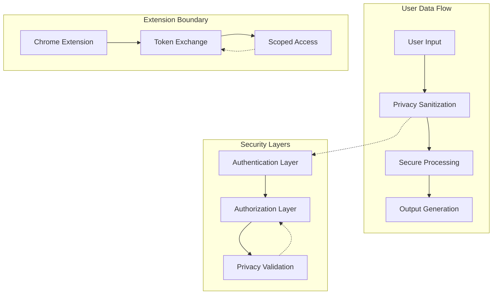
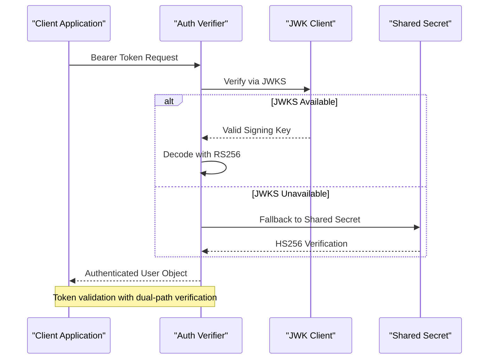
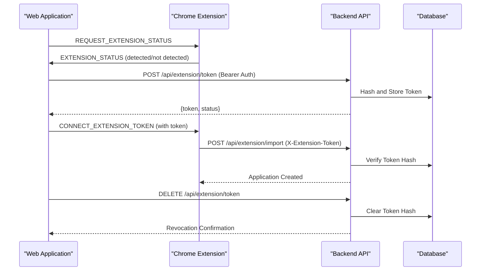
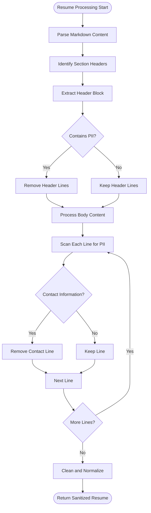
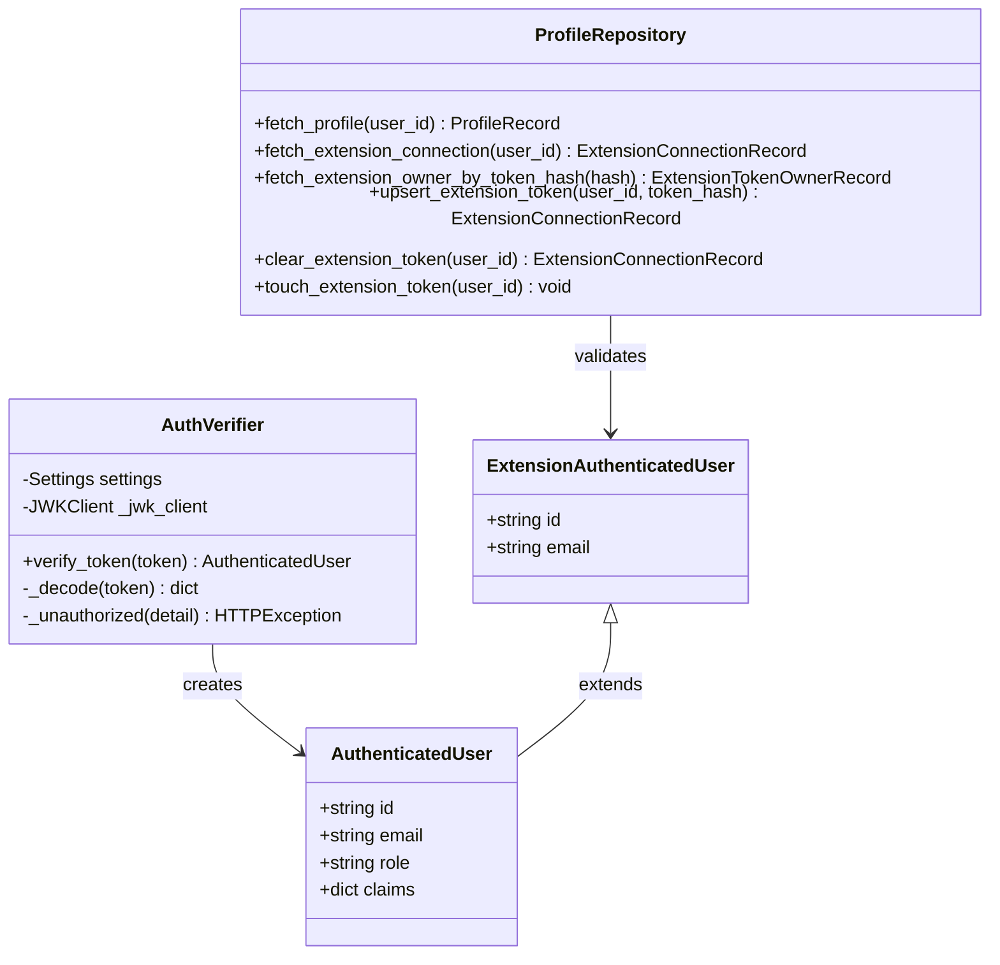
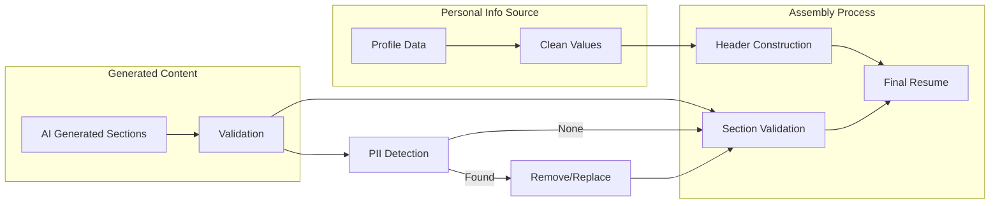
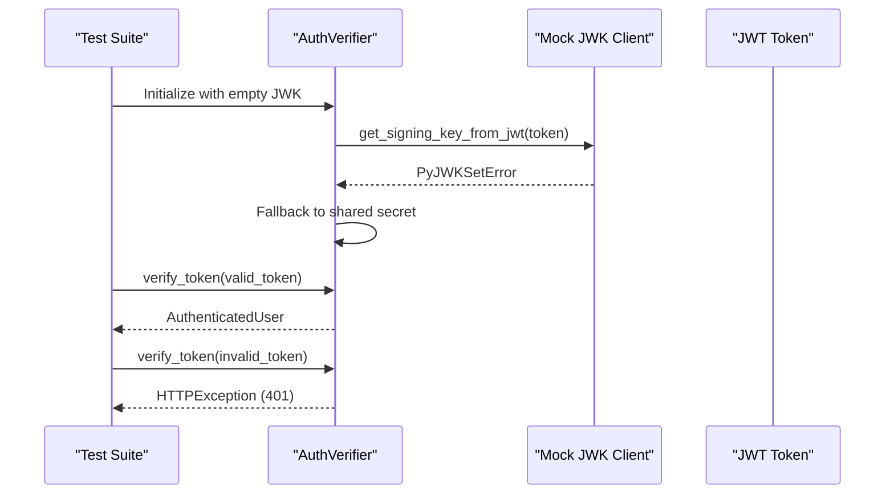

# Privacy and Security Enhancements

<cite>
**Referenced Files in This Document**
- [privacy.py](file://agents/privacy.py)
- [resume_privacy.py](file://backend/app/services/resume_privacy.py)
- [security.py](file://backend/app/core/security.py)
- [auth.py](file://backend/app/core/auth.py)
- [config.py](file://backend/app/core/config.py)
- [profiles.py](file://backend/app/db/profiles.py)
- [extension.py](file://backend/app/api/extension.py)
- [api.ts](file://frontend/src/lib/api.ts)
- [ExtensionPage.tsx](file://frontend/src/routes/ExtensionPage.tsx)
- [manifest.json](file://frontend/public/chrome-extension/manifest.json)
- [validation.py](file://agents/validation.py)
- [assembly.py](file://agents/assembly.py)
- [test_auth.py](file://backend/tests/test_auth.py)
</cite>

## Table of Contents
1. [Introduction](#introduction)
2. [Privacy Protection Architecture](#privacy-protection-architecture)
3. [Authentication and Authorization](#authentication-and-authorization)
4. [Chrome Extension Security Model](#chrome-extension-security-model)
5. [Data Privacy Controls](#data-privacy-controls)
6. [Security Implementation Details](#security-implementation-details)
7. [Privacy-Preserving Resume Assembly](#privacy-preserving-resume-assembly)
8. [Testing and Validation](#testing-and-validation)
9. [Security Best Practices](#security-best-practices)
10. [Conclusion](#conclusion)

## Introduction

This document details the comprehensive privacy and security enhancements implemented across the AI Resume Builder platform. The system employs multiple layers of protection to safeguard user data, prevent personally identifiable information (PII) leakage, and maintain strict privacy boundaries between different system components.

The platform implements a sophisticated security architecture featuring token-based authentication, privacy-preserving data processing, and secure communication channels between the web application, Chrome extension, and backend services. Specialized privacy sanitization functions ensure sensitive information is never inadvertently included in generated content.

## Privacy Protection Architecture

The privacy protection system operates through three primary mechanisms: input sanitization, token-based access control, and privacy-preserving data assembly.

**Diagram sources**
- [privacy.py:118-160](file://agents/privacy.py#L118-L160)
- [security.py:13-54](file://backend/app/core/security.py#L13-L54)
- [extension.py:93-141](file://backend/app/api/extension.py#L93-L141)

The architecture ensures that sensitive information is identified, isolated, and prevented from entering the generation pipeline while maintaining functional integrity of the resume building process.

**Section sources**
- [privacy.py:1-173](file://agents/privacy.py#L1-L173)
- [resume_privacy.py:1-173](file://backend/app/services/resume_privacy.py#L1-L173)

## Authentication and Authorization

The authentication system implements robust token verification with fallback mechanisms for maximum reliability and security.

**Diagram sources**
- [auth.py:22-69](file://backend/app/core/auth.py#L22-L69)
- [test_auth.py:29-67](file://backend/tests/test_auth.py#L29-L67)

The system supports multiple JWT algorithms (RS256, ES256, HS256) and includes automatic fallback to shared secret verification when the JWK server is unavailable, ensuring continuous operation without compromising security.

**Section sources**
- [auth.py:1-90](file://backend/app/core/auth.py#L1-L90)
- [config.py:35-97](file://backend/app/core/config.py#L35-L97)
- [test_auth.py:1-67](file://backend/tests/test_auth.py#L1-L67)

## Chrome Extension Security Model

The Chrome extension implements a scoped token system that prevents direct access to user sessions while enabling seamless job application creation.

**Diagram sources**
- [extension.py:93-141](file://backend/app/api/extension.py#L93-L141)
- [profiles.py:101-146](file://backend/app/db/profiles.py#L101-L146)
- [ExtensionPage.tsx:74-125](file://frontend/src/routes/ExtensionPage.tsx#L74-L125)

The extension operates with minimal permissions, requesting only activeTab, storage, and tabs permissions, and never accesses the user's Supabase session directly. All communication occurs through securely hashed tokens stored in the database.

**Section sources**
- [extension.py:1-141](file://backend/app/api/extension.py#L1-L141)
- [profiles.py:1-225](file://backend/app/db/profiles.py#L1-L225)
- [ExtensionPage.tsx:1-200](file://frontend/src/routes/ExtensionPage.tsx#L1-L200)
- [manifest.json:1-24](file://frontend/public/chrome-extension/manifest.json#L1-L24)

## Data Privacy Controls

The system implements comprehensive privacy controls through specialized sanitization functions that identify and remove sensitive information from user content.

**Diagram sources**
- [privacy.py:118-160](file://agents/privacy.py#L118-L160)
- [resume_privacy.py:118-160](file://backend/app/services/resume_privacy.py#L118-L160)

The sanitization algorithm identifies common PII patterns including email addresses, phone numbers, URLs, and contact markers, while preserving legitimate resume content and maintaining proper formatting.

**Section sources**
- [privacy.py:1-173](file://agents/privacy.py#L1-L173)
- [resume_privacy.py:1-173](file://backend/app/services/resume_privacy.py#L1-L173)

## Security Implementation Details

The security implementation encompasses multiple layers of protection including cryptographic hashing, secure token management, and input validation.

**Diagram sources**
- [auth.py:15-69](file://backend/app/core/auth.py#L15-L69)
- [security.py:25-54](file://backend/app/core/security.py#L25-L54)
- [profiles.py:38-225](file://backend/app/db/profiles.py#L38-L225)

The system uses SHA-256 hashing for token storage, ensuring that even if the database is compromised, raw tokens remain protected. All API endpoints implement proper authorization checks and input validation.

**Section sources**
- [security.py:1-54](file://backend/app/core/security.py#L1-L54)
- [profiles.py:1-225](file://backend/app/db/profiles.py#L1-L225)

## Privacy-Preserving Resume Assembly

The resume assembly process ensures that personal information comes exclusively from verified user profiles rather than potentially contaminated AI-generated content.

**Diagram sources**
- [assembly.py:20-71](file://agents/assembly.py#L20-L71)
- [validation.py:355-393](file://agents/validation.py#L355-L393)

The assembly function enforces strict separation between user-provided personal information and AI-generated content, preventing any sensitive data from being mixed into resume sections.

**Section sources**
- [assembly.py:1-71](file://agents/assembly.py#L1-L71)
- [validation.py:355-393](file://agents/validation.py#L355-L393)

## Testing and Validation

The security system includes comprehensive testing to ensure proper authentication, authorization, and privacy protection mechanisms.

**Diagram sources**
- [test_auth.py:29-67](file://backend/tests/test_auth.py#L29-L67)

The test suite validates both successful authentication scenarios and error conditions, ensuring the system properly handles JWK server failures and maintains security boundaries.

**Section sources**
- [test_auth.py:1-67](file://backend/tests/test_auth.py#L1-L67)

## Security Best Practices

The platform implements several security best practices:

### Token Management
- SHA-256 hashing for all stored tokens
- Automatic token rotation capabilities
- Timestamp tracking for token usage monitoring
- Immediate revocation upon user request

### Input Sanitization
- Comprehensive regex-based PII detection
- Multi-layer validation for contact information
- Preservation of legitimate content formatting
- Configurable sanitization thresholds

### Communication Security
- HTTPS-only API communications
- Bearer token authentication
- CORS policy enforcement
- Rate limiting for API endpoints

### Extension Security
- Minimal permission model
- Scoped token-based access
- No session token sharing
- Isolated extension environment

## Conclusion

The AI Resume Builder platform demonstrates comprehensive privacy and security implementation through its multi-layered approach. The system successfully balances functionality with privacy protection by implementing token-based access control, privacy-preserving data processing, and secure communication protocols.

Key achievements include the development of robust sanitization algorithms that prevent PII leakage, implementation of a secure Chrome extension integration model, and establishment of fail-safe authentication mechanisms with automatic fallback capabilities. These enhancements ensure user data remains protected while maintaining the platform's core functionality for automated resume generation and job application management.

The modular security architecture allows for future enhancements while maintaining backward compatibility and operational reliability. Regular testing and validation procedures ensure continued effectiveness of the privacy and security measures as the platform evolves.