# Application Manager Service

<cite>
**Referenced Files in This Document**
- [application_manager.py](file://backend/app/services/application_manager.py)
- [applications.py](file://backend/app/api/applications.py)
- [applications.py](file://backend/app/db/applications.py)
- [jobs.py](file://backend/app/services/jobs.py)
- [progress.py](file://backend/app/services/progress.py)
- [duplicates.py](file://backend/app/services/duplicates.py)
- [workflow.py](file://backend/app/services/workflow.py)
- [worker.py](file://agents/worker.py)
- [generation.py](file://agents/generation.py)
- [validation.py](file://agents/validation.py)
- [workflow-contract.json](file://shared/workflow-contract.json)
- [decisions-made-1.md](file://docs/decisions-made/decisions-made-1.md)
- [phase_4_generation_failure_reasons.sql](file://supabase/migrations/20260407_000006_phase_4_generation_failure_reasons.sql)
</cite>

## Update Summary
**Changes Made**
- Enhanced stuck generation recovery mechanisms with sophisticated dual-timing approach
- Added separate idle timeout and maximum wall-clock timeout parameters
- Implemented proper handling of full generation workflows with 90-second idle timeout and 300-second maximum cap
- Added comprehensive timeout handling for section regeneration with 45-second idle timeout and 90-second maximum
- Updated error handling strategies with distinct error codes for different timeout scenarios
- Enhanced recovery mechanisms to prevent infinite loops in generation workflows

## Table of Contents
1. [Introduction](#introduction)
2. [Project Structure](#project-structure)
3. [Core Components](#core-components)
4. [Architecture Overview](#architecture-overview)
5. [Detailed Component Analysis](#detailed-component-analysis)
6. [Dependency Analysis](#dependency-analysis)
7. [Performance Considerations](#performance-considerations)
8. [Troubleshooting Guide](#troubleshooting-guide)
9. [Conclusion](#conclusion)
10. [Appendices](#appendices)

## Introduction
This document describes the Application Manager Service that orchestrates the entire job application workflow. It manages application lifecycle stages, coordinates extraction and generation jobs, detects and resolves duplicates, tracks progress via Redis, and handles worker callbacks. The service now includes sophisticated stuck generation recovery mechanisms with dual-timing approach featuring separate idle timeout and maximum wall-clock timeout parameters for both full generation and section regeneration workflows.

## Project Structure
The Application Manager Service spans backend APIs, services, repositories, and worker agents:
- Backend API routes expose application CRUD and workflow actions.
- ApplicationService encapsulates orchestration logic with enhanced timeout handling.
- Repositories manage persistence for applications, drafts, and notifications.
- Job queues enqueue asynchronous tasks for extraction and generation.
- Workers execute jobs and report progress and outcomes with timeout awareness.
- Progress store persists transient workflow progress in Redis with recovery mechanisms.
- Duplicate detector evaluates potential duplicates based on configurable thresholds.

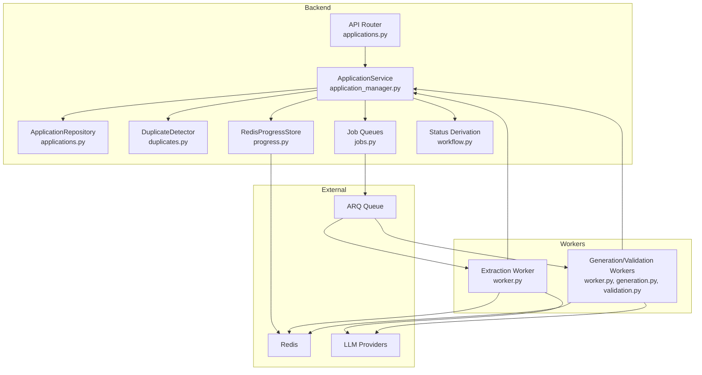

**Diagram sources**
- [applications.py:1-661](file://backend/app/api/applications.py#L1-L661)
- [application_manager.py:143-1543](file://backend/app/services/application_manager.py#L143-L1543)
- [applications.py:123-328](file://backend/app/db/applications.py#L123-L328)
- [duplicates.py:79-184](file://backend/app/services/duplicates.py#L79-L184)
- [progress.py:53-79](file://backend/app/services/progress.py#L53-L79)
- [jobs.py:12-138](file://backend/app/services/jobs.py#L12-L138)
- [workflow.py:11-31](file://backend/app/services/workflow.py#L11-L31)
- [worker.py:526-1236](file://agents/worker.py#L526-L1236)
- [generation.py:159-351](file://agents/generation.py#L159-L351)
- [validation.py:231-292](file://agents/validation.py#L231-L292)

**Section sources**
- [applications.py:1-661](file://backend/app/api/applications.py#L1-L661)
- [application_manager.py:143-1543](file://backend/app/services/application_manager.py#L143-L1543)
- [applications.py:123-328](file://backend/app/db/applications.py#L123-L328)
- [jobs.py:12-138](file://backend/app/services/jobs.py#L12-L138)
- [progress.py:53-79](file://backend/app/services/progress.py#L53-L79)
- [duplicates.py:79-184](file://backend/app/services/duplicates.py#L79-L184)
- [workflow.py:11-31](file://backend/app/services/workflow.py#L11-L31)
- [worker.py:526-1236](file://agents/worker.py#L526-L1236)
- [generation.py:159-351](file://agents/generation.py#L159-L351)
- [validation.py:231-292](file://agents/validation.py#L231-L292)

## Core Components
- ApplicationService: Central orchestrator for application lifecycle, state transitions, duplicate detection, progress tracking, worker callbacks, and sophisticated stuck generation recovery with dual-timing timeout mechanisms.
- ApplicationRepository: Database access for applications, including listing, creating, fetching, and updating records.
- DuplicateDetector: Evaluates potential duplicates using similarity thresholds and match basis heuristics.
- RedisProgressStore: Stores and retrieves transient progress for applications with recovery capabilities.
- Job queues: Enqueue extraction and generation/regeneration jobs to workers with timeout awareness.
- Worker agents: Execute extraction, generation, and validation with individual timeout constraints and comprehensive error handling.

Key responsibilities:
- Creation: From URL or browser capture, enqueue extraction, and initialize progress.
- Updates: Patch application fields; trigger duplicate resolution when relevant fields change.
- Manual entry: Allow users to complete missing job details.
- Retry: Re-queue extraction after failures.
- Generation: Trigger generation with base resume and profile preferences; track progress and outcomes with timeout recovery.
- Regeneration: Full or section-specific regeneration with validation and timeout-aware recovery.
- Progress: Poll progress from Redis; fallback to derived messages with recovery mechanisms.
- Callbacks: Handle worker events to update state and notify users with timeout handling.
- Timeout Recovery: Detect and recover from stuck generation jobs using dual-timing approach.

**Section sources**
- [application_manager.py:143-1543](file://backend/app/services/application_manager.py#L143-L1543)
- [applications.py:123-328](file://backend/app/db/applications.py#L123-L328)
- [duplicates.py:79-184](file://backend/app/services/duplicates.py#L79-L184)
- [progress.py:53-79](file://backend/app/services/progress.py#L53-L79)
- [jobs.py:12-138](file://backend/app/services/jobs.py#L12-L138)
- [workflow.py:11-31](file://backend/app/services/workflow.py#L11-L31)

## Architecture Overview
The Application Manager Service integrates:
- FastAPI endpoints that delegate to ApplicationService.
- ApplicationService coordinating repositories, job queues, progress store, and duplicate detection with timeout recovery mechanisms.
- Workers consuming jobs from ARQ queues, reporting progress to Redis, and invoking LLM providers with individual timeout constraints.
- Contract-driven status derivation mapping internal states to visible statuses with timeout-aware transitions.

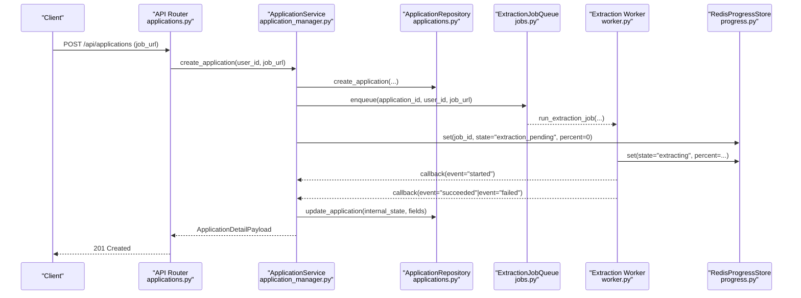

**Diagram sources**
- [applications.py:384-403](file://backend/app/api/applications.py#L384-L403)
- [application_manager.py:183-225](file://backend/app/services/application_manager.py#L183-L225)
- [jobs.py:16-42](file://backend/app/services/jobs.py#L16-L42)
- [worker.py:526-667](file://agents/worker.py#L526-L667)
- [progress.py:67-75](file://backend/app/services/progress.py#L67-L75)

**Section sources**
- [applications.py:384-403](file://backend/app/api/applications.py#L384-L403)
- [application_manager.py:183-225](file://backend/app/services/application_manager.py#L183-L225)
- [jobs.py:16-42](file://backend/app/services/jobs.py#L16-L42)
- [worker.py:526-667](file://agents/worker.py#L526-L667)
- [progress.py:67-75](file://backend/app/services/progress.py#L67-L75)

## Detailed Component Analysis

### ApplicationService
ApplicationService is the central orchestrator with enhanced timeout recovery capabilities. It:
- Creates applications and enqueues extraction jobs.
- Handles manual entry, retries, recovery from captures, and duplicate resolution.
- Triggers generation and regeneration with timeout-aware processing.
- Validates outcomes, updates progress, and manages sophisticated stuck generation recovery.
- Processes worker callbacks to advance state and notify users with timeout handling.
- Derives visible status from internal state and failure reasons with timeout awareness.

Key methods and flows:
- Creation from URL: create_application
- Creation from browser capture: create_application_from_capture
- Manual entry completion: complete_manual_entry
- Retry extraction: retry_extraction
- Recovery from source capture: recover_from_source
- Duplicate resolution: resolve_duplicate
- Generation triggers: trigger_generation, trigger_full_regeneration, trigger_section_regeneration
- Callback handlers: handle_worker_callback, handle_generation_callback, handle_regeneration_callback
- Progress polling: get_progress with automatic timeout recovery
- Draft management: get_draft, save_draft_edit, export_pdf
- Timeout recovery: _detect_and_recover_stuck_generation, _recover_stuck_generation_if_needed

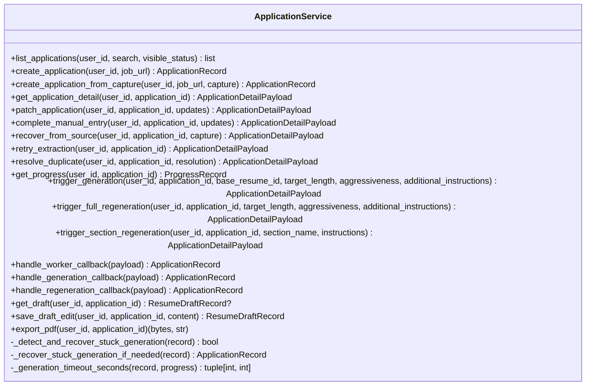

**Diagram sources**
- [application_manager.py:143-1543](file://backend/app/services/application_manager.py#L143-L1543)

**Section sources**
- [application_manager.py:143-1543](file://backend/app/services/application_manager.py#L143-L1543)

### Enhanced Timeout Recovery Mechanisms
The Application Manager Service now implements sophisticated stuck generation recovery with dual-timing approach:

#### Dual-Timing Timeout Parameters
- **Full Generation Workflows**: 90-second idle timeout with 300-second maximum wall-clock cap
- **Section Regeneration Workflows**: 45-second idle timeout with 90-second maximum wall-clock cap

#### Timeout Detection Logic
The system monitors two critical metrics:
- **Idle Timeout**: Time since last progress update indicates job stall
- **Maximum Wall-Clock Timeout**: Absolute time limit prevents indefinite hanging

#### Recovery Process
When timeouts are detected:
1. System identifies target state (generation_pending for initial generation, resume_ready for regeneration)
2. Sets terminal progress with appropriate error code (generation_timeout or regeneration_failed)
3. Creates action-required notification for user
4. Prevents stale worker callbacks from overwriting recovery state

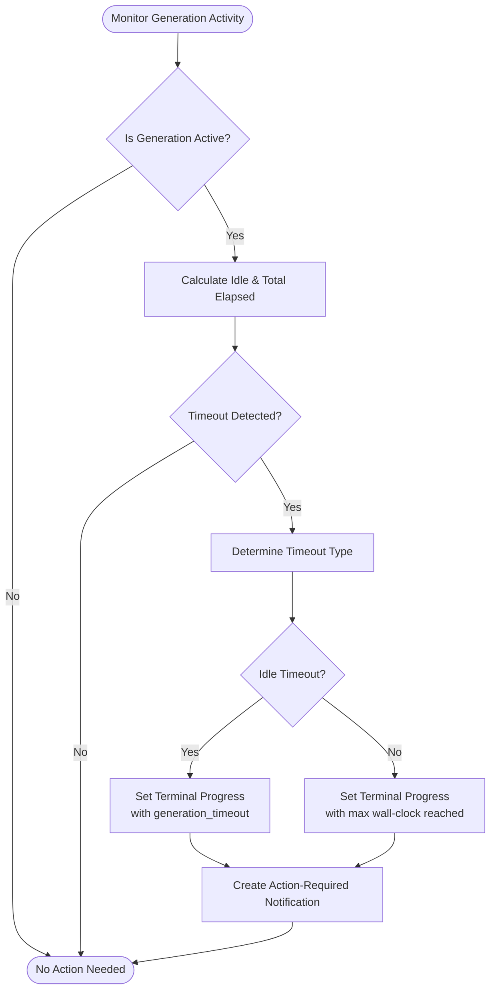

**Diagram sources**
- [application_manager.py:493-566](file://backend/app/services/application_manager.py#L493-L566)
- [application_manager.py:1764-1778](file://backend/app/services/application_manager.py#L1764-L1778)

**Section sources**
- [application_manager.py:493-566](file://backend/app/services/application_manager.py#L493-L566)
- [application_manager.py:1764-1778](file://backend/app/services/application_manager.py#L1764-L1778)
- [decisions-made-1.md:3-11](file://docs/decisions-made/decisions-made-1.md#L3-L11)

### ApplicationRepository
ApplicationRepository provides database operations:
- list_applications with optional filters
- create_application with initial internal state
- fetch_application and fetch_application_unscoped
- update_application with dynamic field updates and enum casting
- fetch_duplicate_candidates and fetch_matched_application

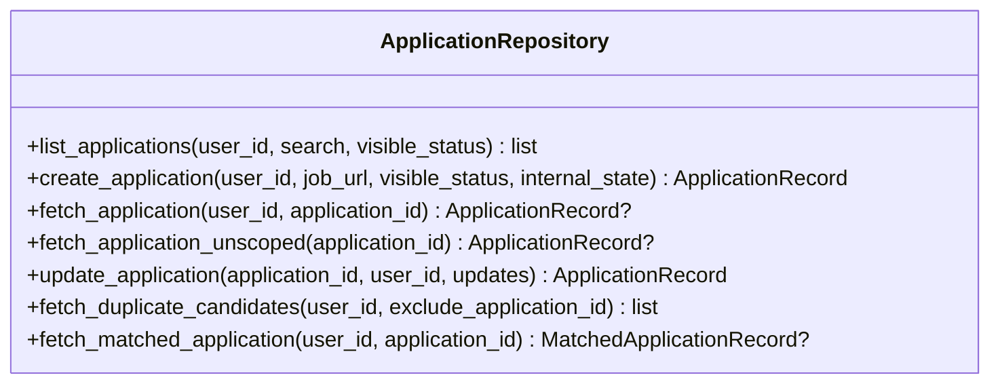

**Diagram sources**
- [applications.py:123-328](file://backend/app/db/applications.py#L123-L328)

**Section sources**
- [applications.py:123-328](file://backend/app/db/applications.py#L123-L328)

### Duplicate Detection
DuplicateDetector evaluates potential duplicates using:
- Normalized similarity between job title/company
- Reference ID extraction from URL or description
- Origin matching and description similarity thresholds
- Match basis classification (exact URL, exact reference ID, origin+description, etc.)

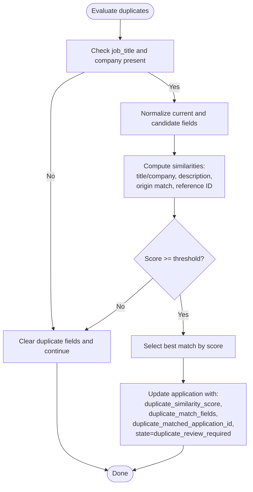

**Diagram sources**
- [duplicates.py:79-184](file://backend/app/services/duplicates.py#L79-L184)
- [application_manager.py:1185-1268](file://backend/app/services/application_manager.py#L1185-L1268)

**Section sources**
- [duplicates.py:79-184](file://backend/app/services/duplicates.py#L79-L184)
- [application_manager.py:1185-1268](file://backend/app/services/application_manager.py#L1185-L1268)

### Progress Tracking and Callback Handling
Progress tracking uses Redis to store transient progress keyed by application ID. ApplicationService sets initial progress upon creation and updates it during extraction and generation. Worker agents report progress and outcomes via callbacks with timeout awareness.

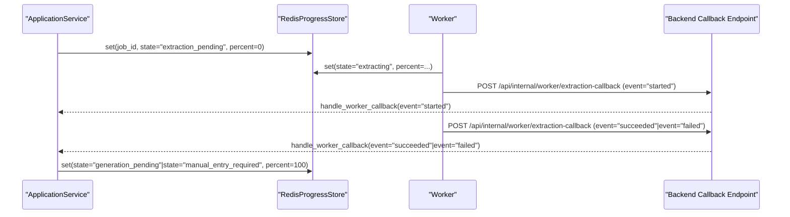

**Diagram sources**
- [progress.py:53-79](file://backend/app/services/progress.py#L53-L79)
- [application_manager.py:455-512](file://backend/app/services/application_manager.py#L455-L512)
- [worker.py:526-667](file://agents/worker.py#L526-L667)

**Section sources**
- [progress.py:53-79](file://backend/app/services/progress.py#L53-L79)
- [application_manager.py:455-512](file://backend/app/services/application_manager.py#L455-L512)
- [worker.py:526-667](file://agents/worker.py#L526-L667)

### Generation and Regeneration Workflows
Generation and regeneration are handled by worker agents with timeout awareness:
- Generation: Generate sections, validate, assemble, and produce a resume with timeout constraints.
- Regeneration: Full or section-specific regeneration with validation, draft updates, and timeout recovery.

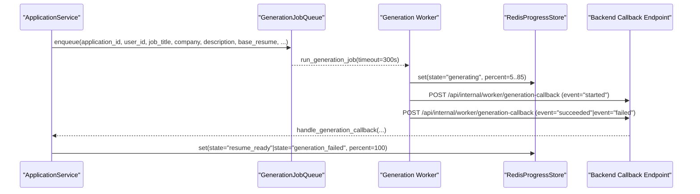

**Diagram sources**
- [jobs.py:49-85](file://backend/app/services/jobs.py#L49-L85)
- [worker.py:682-880](file://agents/worker.py#L682-L880)
- [application_manager.py:603-719](file://backend/app/services/application_manager.py#L603-L719)

**Section sources**
- [jobs.py:49-85](file://backend/app/services/jobs.py#L49-L85)
- [worker.py:682-880](file://agents/worker.py#L682-L880)
- [application_manager.py:603-719](file://backend/app/services/application_manager.py#L603-L719)

### API Endpoints and Payloads
The API exposes endpoints for application management and workflow actions. Request/response models define validation and normalization rules.

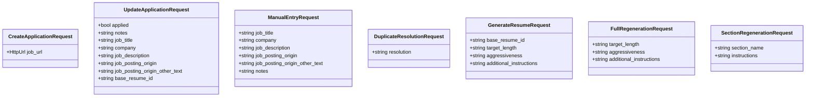

**Diagram sources**
- [applications.py:24-287](file://backend/app/api/applications.py#L24-L287)

**Section sources**
- [applications.py:24-287](file://backend/app/api/applications.py#L24-L287)

## Dependency Analysis
ApplicationService depends on:
- Repositories for persistence
- Job queues for asynchronous processing
- Progress store for transient state with timeout recovery
- Duplicate detector for duplicate evaluation
- Workflow status derivation for visible status mapping
- Worker agents with timeout-aware processing

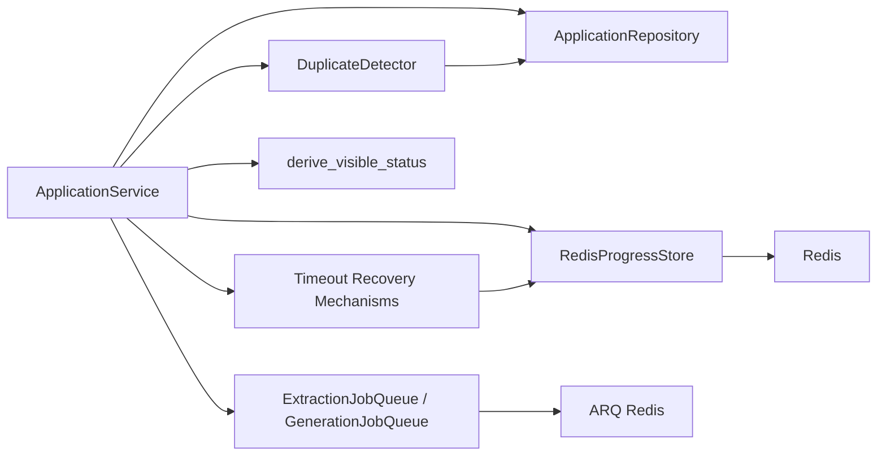

**Diagram sources**
- [application_manager.py:143-1543](file://backend/app/services/application_manager.py#L143-L1543)
- [jobs.py:12-138](file://backend/app/services/jobs.py#L12-L138)
- [progress.py:53-79](file://backend/app/services/progress.py#L53-L79)
- [duplicates.py:79-184](file://backend/app/services/duplicates.py#L79-L184)
- [workflow.py:11-31](file://backend/app/services/workflow.py#L11-L31)

**Section sources**
- [application_manager.py:143-1543](file://backend/app/services/application_manager.py#L143-L1543)
- [jobs.py:12-138](file://backend/app/services/jobs.py#L12-L138)
- [progress.py:53-79](file://backend/app/services/progress.py#L53-L79)
- [duplicates.py:79-184](file://backend/app/services/duplicates.py#L79-L184)
- [workflow.py:11-31](file://backend/app/services/workflow.py#L11-L31)

## Performance Considerations
- Asynchronous job processing: Extraction and generation are offloaded to workers to keep API responses fast.
- Progress polling: Clients poll Redis-backed progress to avoid long-polling on the server.
- Validation timeouts: Generation and regeneration enforce timeouts to prevent resource starvation.
- Section preferences: Generation respects user's section preferences to minimize unnecessary work.
- Fallback mechanisms: On extraction failure, the system transitions to manual entry with a terminal error code stored in progress.
- **Enhanced**: Timeout recovery prevents infinite loops in generation workflows with dual-timing approach.
- **Enhanced**: Separate idle and maximum wall-clock timeouts prevent both false positives and resource starvation.
- **Enhanced**: Sophisticated recovery mechanisms ensure stuck jobs are properly terminated and users are notified.

## Troubleshooting Guide
Common issues and recovery steps:
- Extraction fails due to blocked source: Worker reports failure with details; ApplicationService transitions to manual entry required and sets a terminal error code in progress.
- Extraction timeout: Worker reports failure; ApplicationService transitions to manual entry required.
- Generation timeout or validation failure: Worker reports failure; ApplicationService marks generation failed and notifies the user.
- **Enhanced**: Stuck generation detection: System automatically detects stalled jobs and recovers them with appropriate timeout codes.
- **Enhanced**: Dual-timing timeout handling: Different timeout parameters for full generation (90s idle, 300s max) vs section regeneration (45s idle, 90s max).
- Export failure: ApplicationService updates state to resume_ready with failure reason and creates an action-required notification.

Operational tips:
- Verify Redis connectivity for progress storage.
- Confirm ARQ queue availability and worker health.
- Check LLM provider keys and model configurations.
- Review duplicate resolution status before generation.
- **Enhanced**: Monitor timeout recovery logs for stuck job detection and recovery.
- **Enhanced**: Verify timeout parameters are appropriate for your workload patterns.

**Section sources**
- [application_manager.py:1270-1324](file://backend/app/services/application_manager.py#L1270-L1324)
- [worker.py:645-667](file://agents/worker.py#L645-L667)
- [worker.py:856-905](file://agents/worker.py#L856-L905)
- [application_manager.py:1150-1184](file://backend/app/services/application_manager.py#L1150-L1184)
- [application_manager.py:493-566](file://backend/app/services/application_manager.py#L493-L566)

## Conclusion
The Application Manager Service provides a robust, asynchronous workflow for job application intake, extraction, generation, and regeneration. It integrates cleanly with job queues and Redis-backed progress tracking, supports duplicate detection and resolution, and offers comprehensive error handling and recovery. The enhanced timeout recovery mechanisms with dual-timing approach ensure that stuck generation jobs are properly detected and recovered, preventing infinite loops while allowing legitimate long-running operations to complete successfully.

## Appendices

### Workflow State Machine
Internal states and visible status mapping are defined in the workflow contract and status derivation logic.

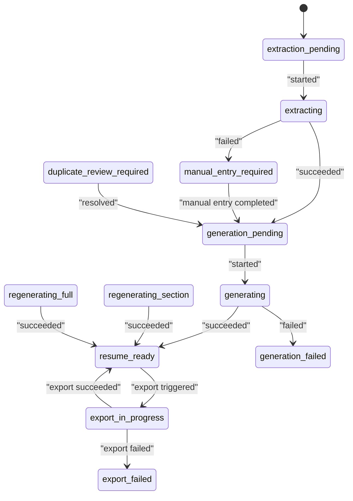

**Diagram sources**
- [workflow-contract.json:9-26](file://shared/workflow-contract.json#L9-L26)
- [workflow.py:11-31](file://backend/app/services/workflow.py#L11-L31)

**Section sources**
- [workflow-contract.json:9-26](file://shared/workflow-contract.json#L9-L26)
- [workflow.py:11-31](file://backend/app/services/workflow.py#L11-L31)

### Enhanced Timeout Recovery Configuration

#### Timeout Parameters
- **Full Generation Workflows**: 
  - Idle Timeout: 90 seconds (no progress updates)
  - Maximum Wall-Clock: 300 seconds (absolute time limit)
- **Section Regeneration Workflows**:
  - Idle Timeout: 45 seconds (no progress updates)
  - Maximum Wall-Clock: 90 seconds (absolute time limit)

#### Error Codes
- **generation_timeout**: Initial generation exceeded idle or maximum timeout
- **generation_cancelled**: User-initiated cancellation
- **regeneration_failed**: Regeneration operation failed (includes timeout)

#### Recovery Behavior
- **Stuck Detection**: Monitors progress timestamps and elapsed time
- **Graceful Recovery**: Sets terminal progress with appropriate error code
- **State Transition**: Moves to generation_pending (initial) or resume_ready (regeneration)
- **User Notification**: Creates action-required notification for timeout recovery

**Section sources**
- [application_manager.py:42-46](file://backend/app/services/application_manager.py#L42-L46)
- [application_manager.py:1764-1778](file://backend/app/services/application_manager.py#L1764-L1778)
- [decisions-made-1.md:3-11](file://docs/decisions-made/decisions-made-1.md#L3-L11)
- [phase_4_generation_failure_reasons.sql:3-4](file://supabase/migrations/20260407_000006_phase_4_generation_failure_reasons.sql#L3-L4)

### Practical Workflows

- Application creation from URL
  - Endpoint: POST /api/applications
  - Service: create_application
  - Outcome: Application created with internal_state extraction_pending; extraction job enqueued; progress initialized.

- Application creation from browser capture
  - Service: create_application_from_capture
  - Outcome: Application created; extraction job enqueued from captured source; progress initialized.

- Manual entry workflow
  - Endpoint: POST /api/applications/{id}/manual-entry
  - Service: complete_manual_entry
  - Outcome: Application updated; duplicate resolution flow runs; state advances to generation_pending if applicable.

- Retry extraction
  - Endpoint: POST /api/applications/{id}/retry-extraction
  - Service: retry_extraction
  - Outcome: Application reset to extraction_pending; extraction job re-enqueued; progress updated.

- Duplicate resolution process
  - Service: resolve_duplicate
  - Outcome: Application state transitions to generation_pending; action-required notification cleared.

- Generation workflow
  - Endpoint: POST /api/applications/{id}/generate
  - Service: trigger_generation
  - Outcome: Generation job enqueued with timeout constraints; progress set to generation_pending; worker validates and assembles resume.

- Regeneration workflow
  - Endpoints: POST /api/applications/{id}/regenerate, POST /api/applications/{id}/regenerate-section
  - Services: trigger_full_regeneration, trigger_section_regeneration
  - Outcome: Regeneration job enqueued with timeout constraints; progress updated; validation performed; draft updated.

- Progress polling
  - Endpoint: GET /api/applications/{id}/progress
  - Service: get_progress with automatic timeout recovery
  - Outcome: Returns Redis-stored progress or derived progress record; automatically recovers stuck generation jobs.

- PDF export
  - Endpoint: GET /api/applications/{id}/export-pdf
  - Service: export_pdf
  - Outcome: Generates PDF, updates application state and draft export timestamps, creates success notification.

**Section sources**
- [applications.py:384-403](file://backend/app/api/applications.py#L384-L403)
- [applications.py:461-477](file://backend/app/api/applications.py#L461-L477)
- [applications.py:444-459](file://backend/app/api/applications.py#L444-L459)
- [applications.py:507-524](file://backend/app/api/applications.py#L507-L524)
- [applications.py:560-579](file://backend/app/api/applications.py#L560-L579)
- [applications.py:582-601](file://backend/app/api/applications.py#L582-L601)
- [applications.py:603-621](file://backend/app/api/applications.py#L603-L621)
- [applications.py:526-539](file://backend/app/api/applications.py#L526-L539)
- [applications.py:641-661](file://backend/app/api/applications.py#L641-L661)
- [application_manager.py:183-225](file://backend/app/services/application_manager.py#L183-L225)
- [application_manager.py:226-246](file://backend/app/services/application_manager.py#L226-L246)
- [application_manager.py:288-305](file://backend/app/services/application_manager.py#L288-L305)
- [application_manager.py:358-411](file://backend/app/services/application_manager.py#L358-L411)
- [application_manager.py:412-437](file://backend/app/services/application_manager.py#L412-L437)
- [application_manager.py:513-602](file://backend/app/services/application_manager.py#L513-L602)
- [application_manager.py:721-814](file://backend/app/services/application_manager.py#L721-L814)
- [application_manager.py:815-905](file://backend/app/services/application_manager.py#L815-L905)
- [application_manager.py:439-454](file://backend/app/services/application_manager.py#L439-L454)
- [application_manager.py:1069-1148](file://backend/app/services/application_manager.py#L1069-L1148)
- [application_manager.py:493-566](file://backend/app/services/application_manager.py#L493-L566)