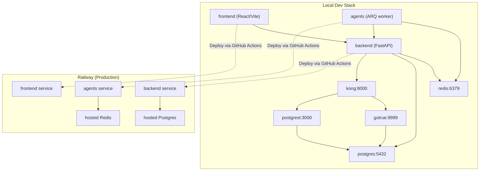
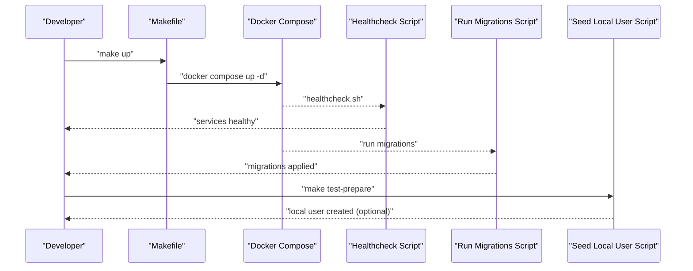
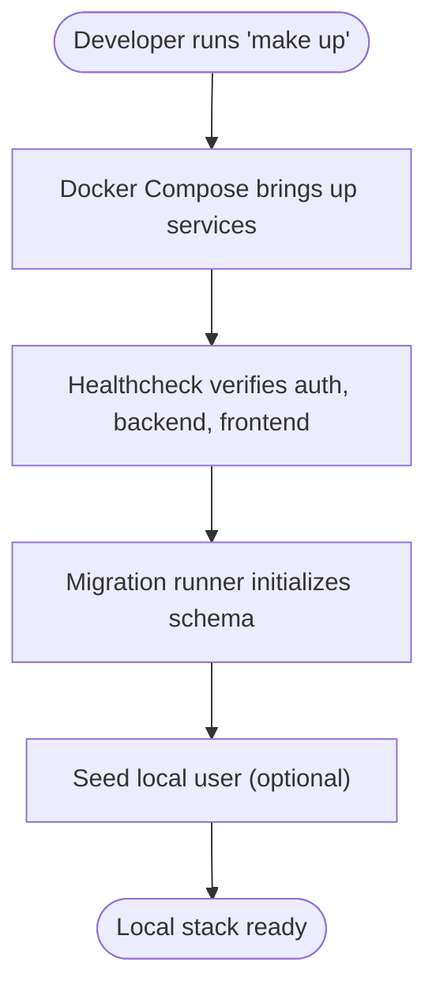
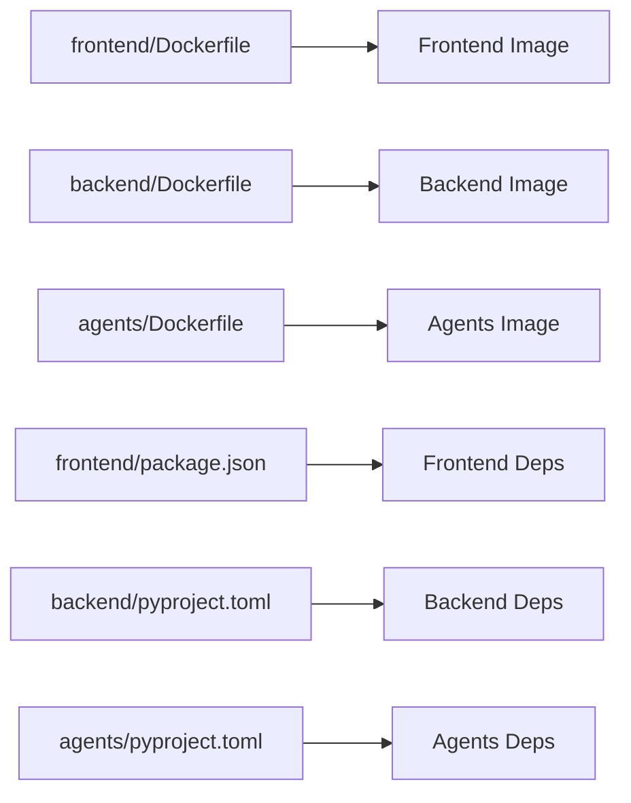
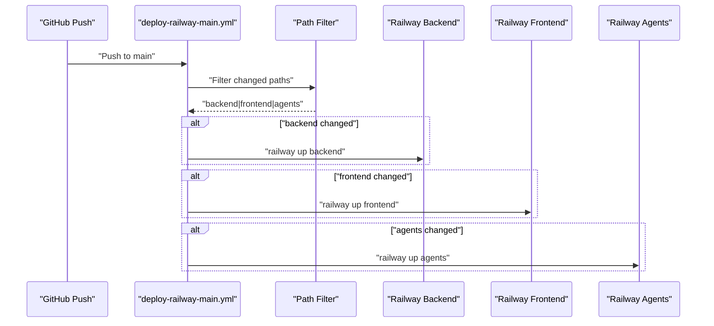
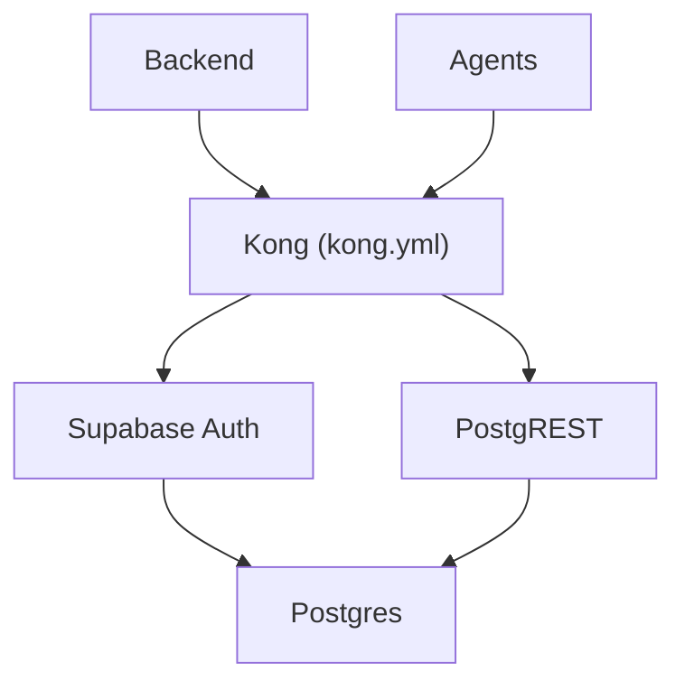
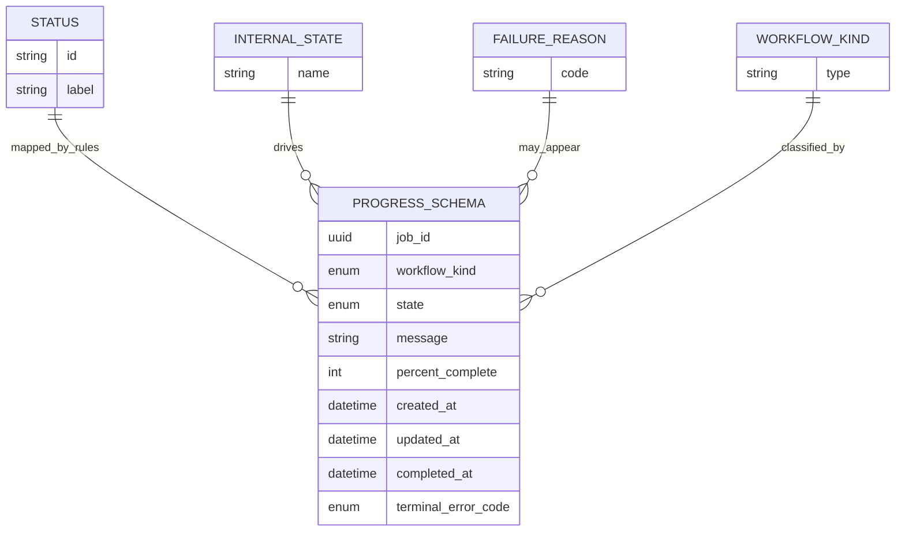
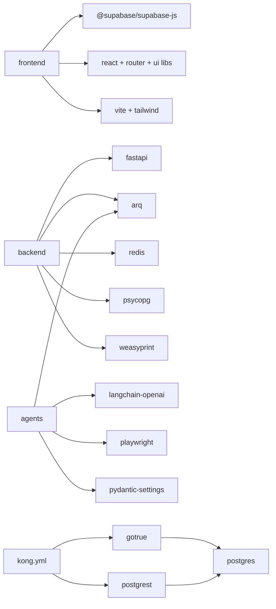

# Build Plan

<cite>
**Referenced Files in This Document**
- [docs/build-plan.md](file://docs/build-plan.md)
- [Makefile](file://Makefile)
- [docker-compose.yml](file://docker-compose.yml)
- [backend/Dockerfile](file://backend/Dockerfile)
- [frontend/Dockerfile](file://frontend/Dockerfile)
- [agents/Dockerfile](file://agents/Dockerfile)
- [scripts/healthcheck.sh](file://scripts/healthcheck.sh)
- [scripts/run_migrations.sh](file://scripts/run_migrations.sh)
- [scripts/seed_local_user.sh](file://scripts/seed_local_user.sh)
- [backend/pyproject.toml](file://backend/pyproject.toml)
- [frontend/package.json](file://frontend/package.json)
- [agents/pyproject.toml](file://agents/pyproject.toml)
- [.github/workflows/deploy-railway-main.yml](file://.github/workflows/deploy-railway-main.yml)
- [supabase/kong/kong.yml](file://supabase/kong/kong.yml)
- [supabase/kong/kong-entrypoint.sh](file://supabase/kong/kong-entrypoint.sh)
- [shared/workflow-contract.json](file://shared/workflow-contract.json)
</cite>

## Table of Contents
1. [Introduction](#introduction)
2. [Project Structure](#project-structure)
3. [Core Components](#core-components)
4. [Architecture Overview](#architecture-overview)
5. [Detailed Component Analysis](#detailed-component-analysis)
6. [Dependency Analysis](#dependency-analysis)
7. [Performance Considerations](#performance-considerations)
8. [Troubleshooting Guide](#troubleshooting-guide)
9. [Conclusion](#conclusion)
10. [Appendices](#appendices)

## Introduction
This document describes the Build Plan for the AI Resume Builder project. It consolidates the roadmap, implementation status, and operational build practices across the frontend, backend, agents (workers), and local development stack. It also documents the containerized local environment, deployment automation, and configuration contracts that ensure reproducible builds and reliable CI/CD on Railway.

## Project Structure
The project is organized into layered services:
- Frontend: React + Vite + Tailwind with TypeScript
- Backend: FastAPI application exposing REST APIs and managing auth, jobs, and integrations
- Agents: Python ARQ worker orchestrating long-running tasks (extraction, generation, validation, assembly)
- Local Dev Stack: Docker Compose with Supabase auth, REST, and Kong gateway, plus Redis and Postgres
- Deployment: GitHub Actions deploying services independently on Railway based on path changes

**Diagram sources**
- [docker-compose.yml:1-194](file://docker-compose.yml#L1-L194)
- [.github/workflows/deploy-railway-main.yml:1-134](file://.github/workflows/deploy-railway-main.yml#L1-L134)

**Section sources**
- [docs/build-plan.md:1-502](file://docs/build-plan.md#L1-L502)
- [docker-compose.yml:1-194](file://docker-compose.yml#L1-L194)

## Core Components
- Local development orchestrated by a Makefile with targets for boot, reset, logs, health, and test preparation
- Docker Compose services for frontend, backend, agents, Supabase auth/REST/Kong, Postgres, and Redis
- Scripts for health verification, database migrations, and seeding a local user
- GitHub Actions pipeline for selective deployments to Railway based on changed paths
- Shared workflow contract defining status mapping, internal states, failure reasons, and progress polling schema

Key build artifacts and roles:
- Frontend Dockerfile installs Node dependencies and runs dev entrypoint
- Backend Dockerfile installs Python dependencies and runs Uvicorn
- Agents Dockerfile installs Python dependencies and Playwright Chromium, then runs ARQ worker
- Backend and Agents pyproject.toml define Python dependencies and dev/test configuration
- Frontend package.json defines Vite/Tailwind/React toolchain and test scripts
- Kong declarative config and entrypoint script wire Supabase auth and REST behind a gateway

**Section sources**
- [Makefile:1-30](file://Makefile#L1-L30)
- [docker-compose.yml:1-194](file://docker-compose.yml#L1-L194)
- [frontend/Dockerfile:1-11](file://frontend/Dockerfile#L1-L11)
- [backend/Dockerfile:1-18](file://backend/Dockerfile#L1-L18)
- [agents/Dockerfile:1-14](file://agents/Dockerfile#L1-L14)
- [frontend/package.json:1-42](file://frontend/package.json#L1-L42)
- [backend/pyproject.toml:1-37](file://backend/pyproject.toml#L1-L37)
- [agents/pyproject.toml:1-26](file://agents/pyproject.toml#L1-L26)
- [supabase/kong/kong.yml:1-96](file://supabase/kong/kong.yml#L1-L96)
- [supabase/kong/kong-entrypoint.sh:1-10](file://supabase/kong/kong-entrypoint.sh#L1-L10)
- [shared/workflow-contract.json:1-122](file://shared/workflow-contract.json#L1-L122)

## Architecture Overview
The build plan ties together a containerized local stack and a production deployment pipeline:
- Local stack: frontend, backend, agents, Supabase (auth, REST, gateway), Postgres, Redis
- Health checks and migrations are automated via scripts
- Railway deployment uses path-filtered jobs to deploy only changed services

**Diagram sources**
- [Makefile:9-26](file://Makefile#L9-L26)
- [scripts/healthcheck.sh:1-35](file://scripts/healthcheck.sh#L1-L35)
- [scripts/run_migrations.sh:1-39](file://scripts/run_migrations.sh#L1-L39)
- [scripts/seed_local_user.sh:1-97](file://scripts/seed_local_user.sh#L1-L97)

**Section sources**
- [docs/build-plan.md:175-232](file://docs/build-plan.md#L175-L232)
- [docker-compose.yml:1-194](file://docker-compose.yml#L1-L194)

## Detailed Component Analysis

### Local Development Stack
- Services: frontend, backend, agents, redis, supabase-db, supabase-auth, supabase-rest, supabase-kong, migration-runner
- Environment variables injected via docker-compose and .env.compose
- Health checks for auth, backend, and frontend endpoints
- Migration runner ensures schema initialization and idempotent application of SQL migrations
- Seed script provisions an invited local user and optionally grants admin role

**Diagram sources**
- [Makefile:9-26](file://Makefile#L9-L26)
- [scripts/healthcheck.sh:21-35](file://scripts/healthcheck.sh#L21-L35)
- [scripts/run_migrations.sh:13-39](file://scripts/run_migrations.sh#L13-L39)
- [scripts/seed_local_user.sh:31-97](file://scripts/seed_local_user.sh#L31-L97)

**Section sources**
- [docker-compose.yml:1-194](file://docker-compose.yml#L1-L194)
- [scripts/healthcheck.sh:1-35](file://scripts/healthcheck.sh#L1-L35)
- [scripts/run_migrations.sh:1-39](file://scripts/run_migrations.sh#L1-L39)
- [scripts/seed_local_user.sh:1-97](file://scripts/seed_local_user.sh#L1-L97)

### Container Images and Dependencies
- Frontend: Node 22 Alpine, installs deps, runs dev entrypoint
- Backend: Python 3.12 Slim, installs dependencies, runs Uvicorn
- Agents: Python 3.12 Bookworm, installs dependencies and Playwright Chromium, runs ARQ worker
- Python dependencies declared in pyproject.toml for backend and agents
- Frontend dependencies declared in package.json for Vite/Tailwind/React

**Diagram sources**
- [frontend/Dockerfile:1-11](file://frontend/Dockerfile#L1-L11)
- [backend/Dockerfile:1-18](file://backend/Dockerfile#L1-L18)
- [agents/Dockerfile:1-14](file://agents/Dockerfile#L1-L14)
- [frontend/package.json:1-42](file://frontend/package.json#L1-L42)
- [backend/pyproject.toml:1-37](file://backend/pyproject.toml#L1-L37)
- [agents/pyproject.toml:1-26](file://agents/pyproject.toml#L1-L26)

**Section sources**
- [frontend/Dockerfile:1-11](file://frontend/Dockerfile#L1-L11)
- [backend/Dockerfile:1-18](file://backend/Dockerfile#L1-L18)
- [agents/Dockerfile:1-14](file://agents/Dockerfile#L1-L14)
- [frontend/package.json:1-42](file://frontend/package.json#L1-L42)
- [backend/pyproject.toml:1-37](file://backend/pyproject.toml#L1-L37)
- [agents/pyproject.toml:1-26](file://agents/pyproject.toml#L1-L26)

### Deployment Pipeline (Railway)
- Path-filtered GitHub Actions detects changes in backend, frontend, or agents
- Deploys only changed services to Railway with project and service IDs from secrets
- Supports selective deploys to reduce downtime and improve reliability

**Diagram sources**
- [.github/workflows/deploy-railway-main.yml:1-134](file://.github/workflows/deploy-railway-main.yml#L1-L134)

**Section sources**
- [.github/workflows/deploy-railway-main.yml:1-134](file://.github/workflows/deploy-railway-main.yml#L1-L134)

### Supabase Gateway and Authentication
- Kong declarative config exposes auth and REST endpoints with ACL and key-auth
- Entry script injects keys from environment variables
- Backend and agents consume Supabase URLs and keys from environment

**Diagram sources**
- [supabase/kong/kong.yml:1-96](file://supabase/kong/kong.yml#L1-L96)
- [supabase/kong/kong-entrypoint.sh:1-10](file://supabase/kong/kong-entrypoint.sh#L1-L10)
- [docker-compose.yml:118-189](file://docker-compose.yml#L118-L189)

**Section sources**
- [supabase/kong/kong.yml:1-96](file://supabase/kong/kong.yml#L1-L96)
- [supabase/kong/kong-entrypoint.sh:1-10](file://supabase/kong/kong-entrypoint.sh#L1-L10)
- [docker-compose.yml:118-189](file://docker-compose.yml#L118-L189)

### Shared Workflow Contract
- Defines visible statuses, internal states, failure reasons, workflow kinds, and mapping rules
- Provides a schema for progress polling responses
- Ensures frontend, backend, and agents interpret workflow states consistently

**Diagram sources**
- [shared/workflow-contract.json:1-122](file://shared/workflow-contract.json#L1-L122)

**Section sources**
- [shared/workflow-contract.json:1-122](file://shared/workflow-contract.json#L1-L122)

## Dependency Analysis
- Frontend depends on Supabase JS SDK, React, Tailwind, and Vite toolchain
- Backend depends on FastAPI, ARQ, Redis, Postgres driver, WeasyPrint, and others
- Agents depend on ARQ, LangChain OpenAI, Playwright, and pydantic settings
- All services rely on environment variables defined in docker-compose and .env.compose
- GitHub Actions depend on Railway CLI and project/service IDs from secrets

**Diagram sources**
- [frontend/package.json:13-25](file://frontend/package.json#L13-L25)
- [backend/pyproject.toml:10-22](file://backend/pyproject.toml#L10-L22)
- [agents/pyproject.toml:10-16](file://agents/pyproject.toml#L10-L16)
- [supabase/kong/kong.yml:18-96](file://supabase/kong/kong.yml#L18-L96)

**Section sources**
- [frontend/package.json:1-42](file://frontend/package.json#L1-L42)
- [backend/pyproject.toml:1-37](file://backend/pyproject.toml#L1-L37)
- [agents/pyproject.toml:1-26](file://agents/pyproject.toml#L1-L26)
- [supabase/kong/kong.yml:1-96](file://supabase/kong/kong.yml#L1-L96)

## Performance Considerations
- Container images use slim/base Alpine variants to minimize footprint
- Backend installs Cairo/Pango libraries for WeasyPrint PDF rendering
- Playwright installation in agents image includes Chromium with dependencies
- Redis and Postgres are separate services; ensure resource limits in production
- Use Railway’s platform resources and scaling for production workloads

[No sources needed since this section provides general guidance]

## Troubleshooting Guide
Common issues and remedies:
- Empty JWKS during JWT verification: backend now treats empty JWKS like key-fetch failures and falls back to configured shared secret
- Local Supabase health: use healthcheck script to verify auth, backend, and frontend endpoints
- Migrations not applied: migration runner creates schema_meta and tracks applied migrations; ensure DB readiness loop completes
- Local user creation: seed script requires Supabase health and service role key; handles existence and admin promotion
- Railway connectivity: agents require REDIS_URL wired in production; ensure service-to-service env vars are set

**Section sources**
- [docs/build-plan.md:43-43](file://docs/build-plan.md#L43-L43)
- [scripts/healthcheck.sh:21-35](file://scripts/healthcheck.sh#L21-L35)
- [scripts/run_migrations.sh:13-39](file://scripts/run_migrations.sh#L13-L39)
- [scripts/seed_local_user.sh:31-97](file://scripts/seed_local_user.sh#L31-L97)
- [docs/build-plan.md:151-151](file://docs/build-plan.md#L151-L151)

## Conclusion
The Build Plan establishes a robust, reproducible local development environment and a streamlined CI/CD pipeline for production. The shared workflow contract and containerized stack ensure consistent behavior across frontend, backend, and agents. The path-filtered Railway deployments minimize disruption while enabling rapid iteration across services.

[No sources needed since this section summarizes without analyzing specific files]

## Appendices

### Build Commands and Targets
- make up: bring up the stack with Docker Compose
- make down: tear down the stack
- make reset: reset volumes and rebuild
- make logs: follow container logs
- make health: run health checks
- make test-prepare: seed local user (optional)

**Section sources**
- [Makefile:9-26](file://Makefile#L9-L26)

### Environment Variables Reference
- APP_ENV, APP_DEV_MODE, API_URL, SUPABASE_URL, SUPABASE_INTERNAL_URL, SERVICE_ROLE_KEY, JWT_SECRET, ADMIN_EMAILS, INVITE_LINK_EXPIRY_HOURS, WORKER_CALLBACK_SECRET, DUPLICATE_SIMILARITY_THRESHOLD, EMAIL_NOTIFICATIONS_ENABLED, RESEND_API_KEY, EMAIL_FROM
- FRONTEND_PORT, BACKEND_HOST_PORT, SUPABASE_DB_HOST_PORT, SUPABASE_GATEWAY_PORT
- POSTGRES_PASSWORD, OPENROUTER_API_KEY, OPENROUTER_BASE_URL, EXTRACTION_AGENT_MODEL, GENERATION_AGENT_MODEL, VALIDATION_AGENT_MODEL

**Section sources**
- [docker-compose.yml:26-77](file://docker-compose.yml#L26-L77)