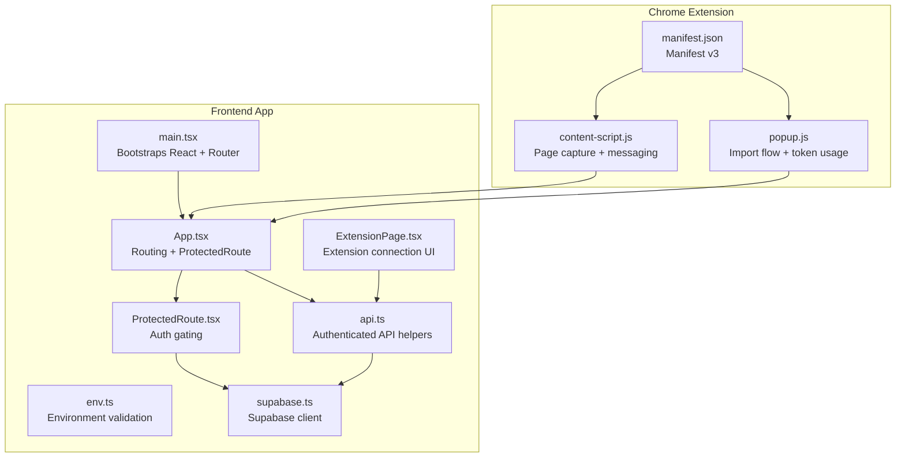
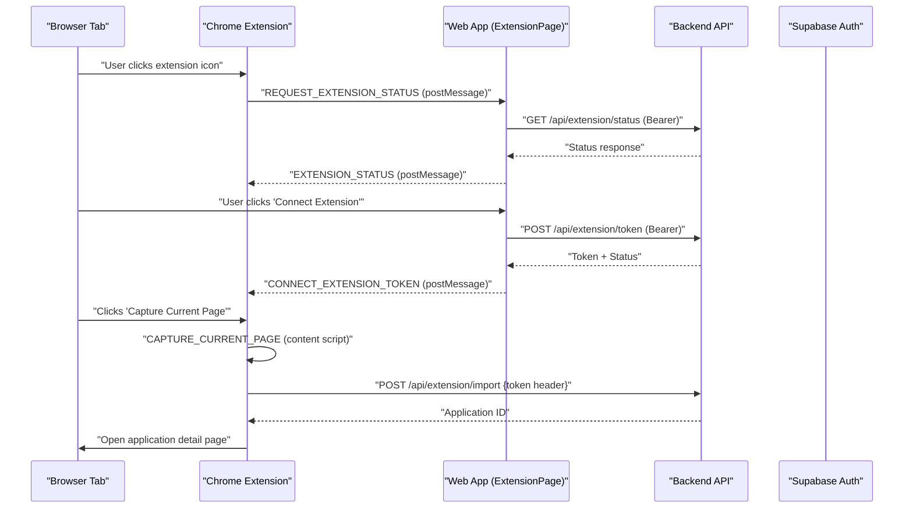
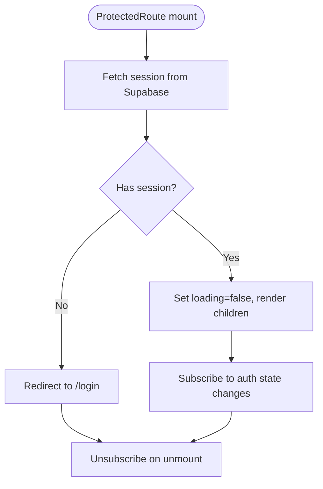
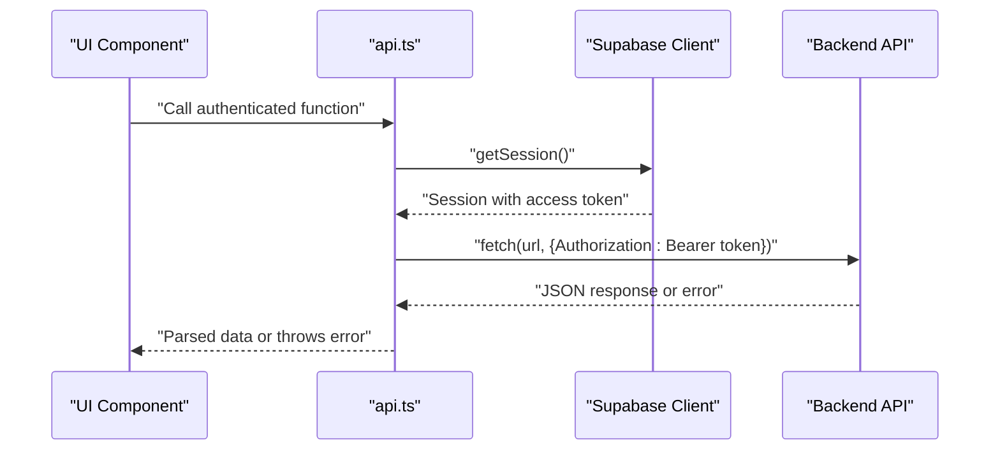
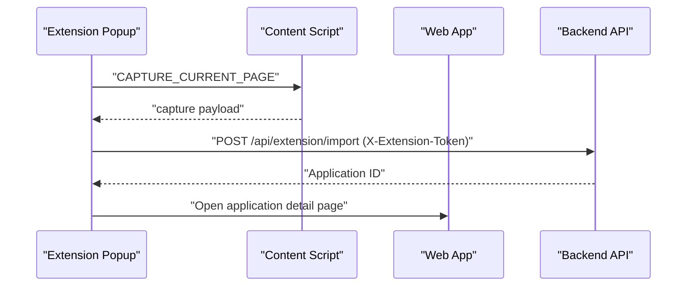
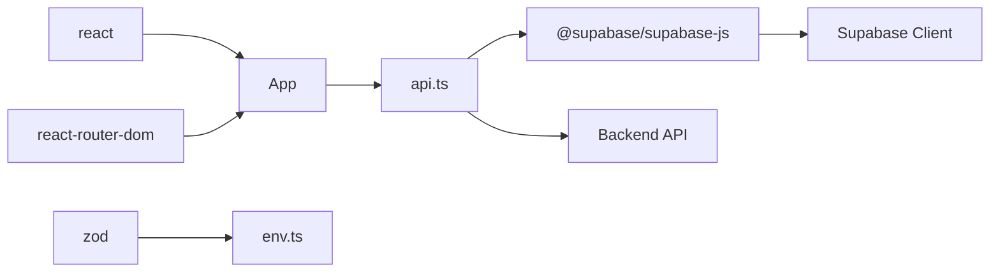

# Frontend Integration

<cite>
**Referenced Files in This Document**
- [main.tsx](file://frontend/src/main.tsx)
- [App.tsx](file://frontend/src/App.tsx)
- [package.json](file://frontend/package.json)
- [vite.config.ts](file://frontend/vite.config.ts)
- [env.ts](file://frontend/src/lib/env.ts)
- [supabase.ts](file://frontend/src/lib/supabase.ts)
- [api.ts](file://frontend/src/lib/api.ts)
- [ProtectedRoute.tsx](file://frontend/src/routes/ProtectedRoute.tsx)
- [ExtensionPage.tsx](file://frontend/src/routes/ExtensionPage.tsx)
- [manifest.json](file://frontend/public/chrome-extension/manifest.json)
- [content-script.js](file://frontend/public/chrome-extension/content-script.js)
- [popup.js](file://frontend/public/chrome-extension/popup.js)
- [tailwind.config.ts](file://frontend/tailwind.config.ts)
- [postcss.config.cjs](file://frontend/postcss.config.cjs)
</cite>

## Table of Contents
1. [Introduction](#introduction)
2. [Project Structure](#project-structure)
3. [Core Components](#core-components)
4. [Architecture Overview](#architecture-overview)
5. [Detailed Component Analysis](#detailed-component-analysis)
6. [Dependency Analysis](#dependency-analysis)
7. [Performance Considerations](#performance-considerations)
8. [Troubleshooting Guide](#troubleshooting-guide)
9. [Conclusion](#conclusion)

## Introduction
This document explains how the frontend integrates with Supabase authentication, the backend API, and the Chrome extension bridge. It covers routing, authentication protection, environment configuration, API utilities, and the end-to-end flow for capturing job postings via the Chrome extension into the web application.

## Project Structure
The frontend is a React application built with Vite, styled with Tailwind CSS. It includes:
- Application bootstrap and routing
- Authentication guard and Supabase client
- API utilities for authenticated requests
- Chrome extension integration assets and scripts
- UI components and styling configuration

**Diagram sources**
- [main.tsx:1-14](file://frontend/src/main.tsx#L1-L14)
- [App.tsx:1-36](file://frontend/src/App.tsx#L1-L36)
- [ProtectedRoute.tsx:1-44](file://frontend/src/routes/ProtectedRoute.tsx#L1-L44)
- [env.ts:1-15](file://frontend/src/lib/env.ts#L1-L15)
- [supabase.ts:1-26](file://frontend/src/lib/supabase.ts#L1-L26)
- [api.ts:1-495](file://frontend/src/lib/api.ts#L1-L495)
- [ExtensionPage.tsx:1-200](file://frontend/src/routes/ExtensionPage.tsx#L1-L200)
- [manifest.json:1-24](file://frontend/public/chrome-extension/manifest.json#L1-L24)
- [content-script.js:1-118](file://frontend/public/chrome-extension/content-script.js#L1-L118)
- [popup.js:1-156](file://frontend/public/chrome-extension/popup.js#L1-L156)

**Section sources**
- [main.tsx:1-14](file://frontend/src/main.tsx#L1-L14)
- [App.tsx:1-36](file://frontend/src/App.tsx#L1-L36)
- [package.json:1-38](file://frontend/package.json#L1-L38)
- [vite.config.ts:1-24](file://frontend/vite.config.ts#L1-L24)
- [tailwind.config.ts:1-25](file://frontend/tailwind.config.ts#L1-L25)
- [postcss.config.cjs:1-7](file://frontend/postcss.config.cjs#L1-L7)

## Core Components
- Application bootstrap and routing: Initializes React, Router, and global styles.
- Authentication protection: Guards protected routes using Supabase session state.
- Environment configuration: Validates and exposes runtime environment variables.
- Supabase client: Provides a singleton browser client with session persistence.
- API utilities: Centralized authenticated HTTP helpers for all backend endpoints.
- Extension integration: UI for managing extension connection and messaging helpers for capture and import.

**Section sources**
- [main.tsx:1-14](file://frontend/src/main.tsx#L1-L14)
- [App.tsx:1-36](file://frontend/src/App.tsx#L1-L36)
- [ProtectedRoute.tsx:1-44](file://frontend/src/routes/ProtectedRoute.tsx#L1-L44)
- [env.ts:1-15](file://frontend/src/lib/env.ts#L1-L15)
- [supabase.ts:1-26](file://frontend/src/lib/supabase.ts#L1-L26)
- [api.ts:1-495](file://frontend/src/lib/api.ts#L1-L495)
- [ExtensionPage.tsx:1-200](file://frontend/src/routes/ExtensionPage.tsx#L1-L200)

## Architecture Overview
The frontend enforces authentication, manages environment variables, and communicates with the backend through authenticated APIs. The Chrome extension acts as a browser-side bridge that captures page metadata and imports job applications into the web app using a scoped token.

**Diagram sources**
- [ExtensionPage.tsx:35-72](file://frontend/src/routes/ExtensionPage.tsx#L35-L72)
- [ExtensionPage.tsx:74-100](file://frontend/src/routes/ExtensionPage.tsx#L74-L100)
- [ExtensionPage.tsx:102-125](file://frontend/src/routes/ExtensionPage.tsx#L102-L125)
- [content-script.js:60-74](file://frontend/public/chrome-extension/content-script.js#L60-L74)
- [content-script.js:76-117](file://frontend/public/chrome-extension/content-script.js#L76-L117)
- [popup.js:95-136](file://frontend/public/chrome-extension/popup.js#L95-L136)
- [api.ts:312-326](file://frontend/src/lib/api.ts#L312-L326)

## Detailed Component Analysis

### Routing and Authentication Protection
- The app initializes React and wraps the app in a router. Protected routes are wrapped in a route guard that checks Supabase session state and redirects unauthenticated users to the login page.
- The guard subscribes to auth state changes and renders a loading state while checking session status.

**Diagram sources**
- [ProtectedRoute.tsx:10-26](file://frontend/src/routes/ProtectedRoute.tsx#L10-L26)
- [ProtectedRoute.tsx:38-42](file://frontend/src/routes/ProtectedRoute.tsx#L38-L42)

**Section sources**
- [App.tsx:12-35](file://frontend/src/App.tsx#L12-L35)
- [ProtectedRoute.tsx:1-44](file://frontend/src/routes/ProtectedRoute.tsx#L1-L44)

### Environment Configuration
- Runtime environment variables are validated using Zod before being exposed to the app. Required variables include Supabase URL, anonymous key, and API URL.
- The configuration ensures early failures if environment is misconfigured.

**Section sources**
- [env.ts:1-15](file://frontend/src/lib/env.ts#L1-L15)
- [package.json:6-12](file://frontend/package.json#L6-L12)

### Supabase Client Management
- A singleton browser client is created lazily with session persistence enabled. Options configure automatic token refresh and sessionStorage for browser environments.
- The client is reused across the app for authentication state and session retrieval.

**Section sources**
- [supabase.ts:1-26](file://frontend/src/lib/supabase.ts#L1-L26)

### API Utilities and Authenticated Requests
- All API calls are authenticated using the current Supabase session token. Helpers encapsulate request construction, error handling, and JSON parsing.
- Uploads use multipart/form-data with a dedicated upload helper.
- PDF export returns a Blob for client-side download.
- The module defines comprehensive types for application, base resume, profile, and extension connection states.

**Diagram sources**
- [api.ts:177-214](file://frontend/src/lib/api.ts#L177-L214)
- [api.ts:216-238](file://frontend/src/lib/api.ts#L216-L238)
- [api.ts:474-494](file://frontend/src/lib/api.ts#L474-L494)

**Section sources**
- [api.ts:177-214](file://frontend/src/lib/api.ts#L177-L214)
- [api.ts:216-238](file://frontend/src/lib/api.ts#L216-L238)
- [api.ts:312-326](file://frontend/src/lib/api.ts#L312-L326)
- [api.ts:474-494](file://frontend/src/lib/api.ts#L474-L494)

### Chrome Extension Integration
- Manifest v3 declares permissions, background service worker, action popup, and content script injection across all URLs.
- Content script listens for messages to capture page metadata and responds with structured data. It also handles bridge status and token storage messages from the web app.
- Popup script validates connection state, captures the active tab, and posts import requests to the backend using the extension-scoped token header.
- The Extension page coordinates connection, revocation, and status reporting via postMessage with the extension bridge.

**Diagram sources**
- [manifest.json:1-24](file://frontend/public/chrome-extension/manifest.json#L1-L24)
- [content-script.js:60-74](file://frontend/public/chrome-extension/content-script.js#L60-L74)
- [content-script.js:76-117](file://frontend/public/chrome-extension/content-script.js#L76-L117)
- [popup.js:95-136](file://frontend/public/chrome-extension/popup.js#L95-L136)

**Section sources**
- [manifest.json:1-24](file://frontend/public/chrome-extension/manifest.json#L1-L24)
- [content-script.js:1-118](file://frontend/public/chrome-extension/content-script.js#L1-L118)
- [popup.js:1-156](file://frontend/public/chrome-extension/popup.js#L1-L156)
- [ExtensionPage.tsx:1-200](file://frontend/src/routes/ExtensionPage.tsx#L1-L200)

### Styling and Build Configuration
- Tailwind CSS is configured with custom color tokens, fonts, and shadows. PostCSS applies Tailwind and Autoprefixer.
- Vite resolves aliases for @ (src) and @shared, enables test environment with jsdom, and allows serving from parent directory for development.

**Section sources**
- [tailwind.config.ts:1-25](file://frontend/tailwind.config.ts#L1-L25)
- [postcss.config.cjs:1-7](file://frontend/postcss.config.cjs#L1-L7)
- [vite.config.ts:1-24](file://frontend/vite.config.ts#L1-L24)

## Dependency Analysis
- Runtime dependencies include React, React Router, Supabase JS SDK, React Markdown, and Zod for environment validation.
- Dev dependencies include Vite, TypeScript, Tailwind CSS, and testing libraries.
- The app relies on Supabase for authentication and on the backend API for all application data and workflows.

**Diagram sources**
- [package.json:13-21](file://frontend/package.json#L13-L21)
- [package.json:22-36](file://frontend/package.json#L22-L36)
- [env.ts:1-15](file://frontend/src/lib/env.ts#L1-L15)
- [supabase.ts:1-26](file://frontend/src/lib/supabase.ts#L1-L26)
- [api.ts:1-495](file://frontend/src/lib/api.ts#L1-L495)

**Section sources**
- [package.json:1-38](file://frontend/package.json#L1-L38)

## Performance Considerations
- Prefer lazy-loading non-critical routes and components to reduce initial bundle size.
- Cache API responses where appropriate and avoid unnecessary re-renders in frequently updated components.
- Minimize DOM reads/writes in content scripts to keep page capture fast.
- Use browser storage efficiently in the extension to avoid blocking operations.

## Troubleshooting Guide
- Authentication redirect loop: Verify Supabase session state and ensure the auth listener is properly subscribed/unsubscribed.
- Missing environment variables: Confirm all required environment variables are present and correctly formatted.
- Extension connection errors: Check that the extension popup reports a valid token and app URL, and that the web app receives the expected postMessage events.
- Import failures: Inspect network requests for 401 responses indicating expired tokens and prompt reconnection.

**Section sources**
- [ProtectedRoute.tsx:10-26](file://frontend/src/routes/ProtectedRoute.tsx#L10-L26)
- [env.ts:1-15](file://frontend/src/lib/env.ts#L1-L15)
- [ExtensionPage.tsx:35-72](file://frontend/src/routes/ExtensionPage.tsx#L35-L72)
- [popup.js:118-126](file://frontend/public/chrome-extension/popup.js#L118-L126)

## Conclusion
The frontend integrates tightly with Supabase for authentication and with the backend API for application workflows. The Chrome extension bridge enables seamless capture of job postings into the application using a scoped token. The architecture emphasizes secure, authenticated communication, robust error handling, and a clear separation between UI, routing, and data access layers.