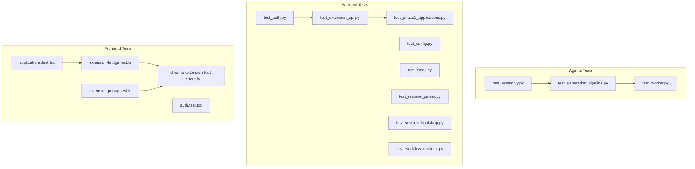
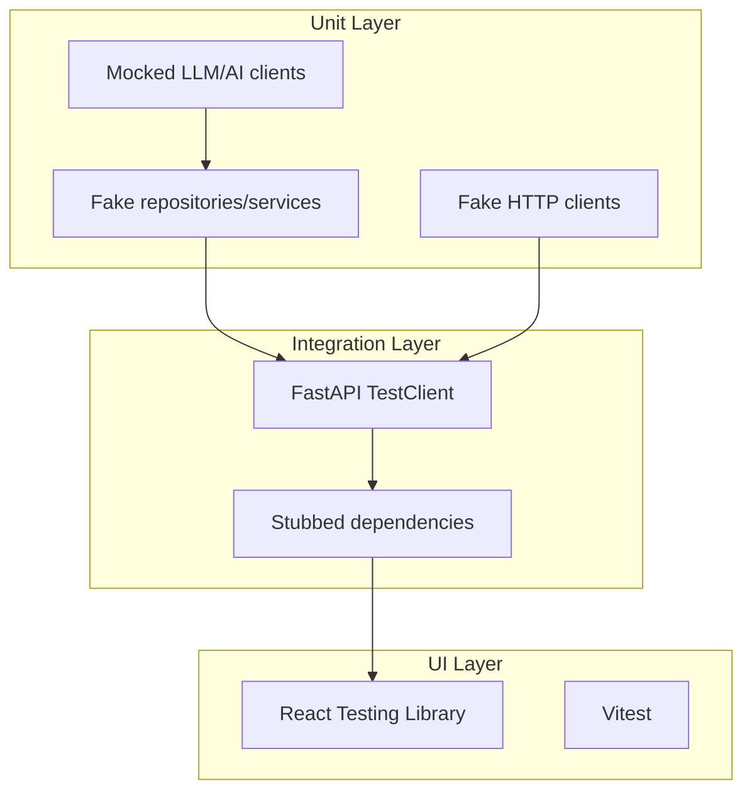
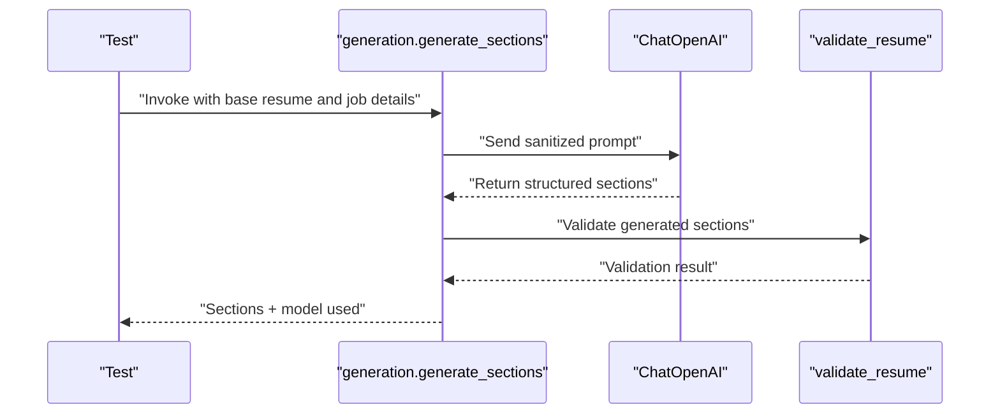
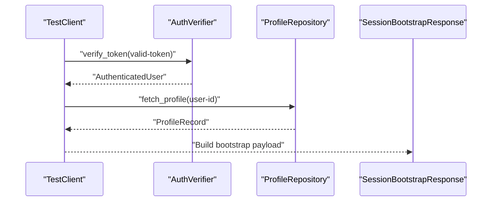
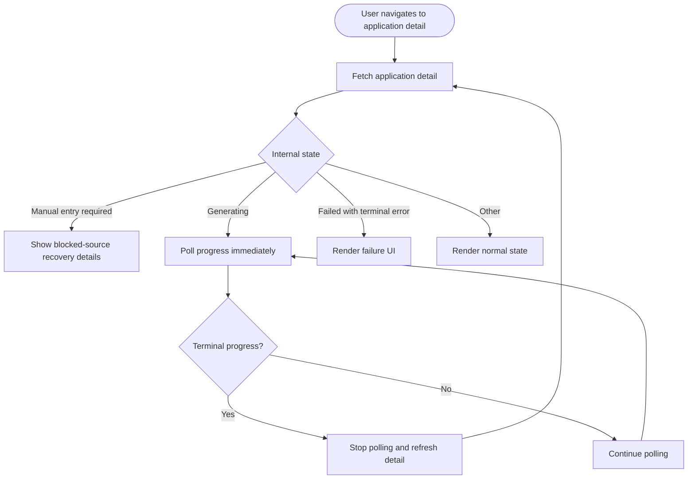
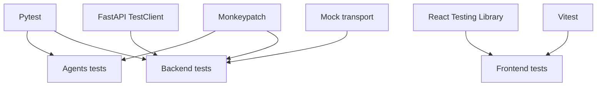

# Testing Infrastructure

<cite>
**Referenced Files in This Document**
- [test_assembly.py](file://agents/tests/test_assembly.py)
- [test_generation_pipeline.py](file://agents/tests/test_generation_pipeline.py)
- [test_worker.py](file://agents/tests/test_worker.py)
- [test_auth.py](file://backend/tests/test_auth.py)
- [test_config.py](file://backend/tests/test_config.py)
- [test_email.py](file://backend/tests/test_email.py)
- [test_extension_api.py](file://backend/tests/test_extension_api.py)
- [test_phase1_applications.py](file://backend/tests/test_phase1_applications.py)
- [test_resume_parser.py](file://backend/tests/test_resume_parser.py)
- [test_session_bootstrap.py](file://backend/tests/test_session_bootstrap.py)
- [test_workflow_contract.py](file://backend/tests/test_workflow_contract.py)
- [applications.test.tsx](file://frontend/src/test/applications.test.tsx)
- [auth.test.tsx](file://frontend/src/test/auth.test.tsx)
- [extension-bridge.test.ts](file://frontend/src/test/extension-bridge.test.ts)
- [extension-popup.test.ts](file://frontend/src/test/extension-popup.test.ts)
- [chrome-extension-test-helpers.ts](file://frontend/src/test/chrome-extension-test-helpers.ts)
</cite>

## Table of Contents
1. [Introduction](#introduction)
2. [Project Structure](#project-structure)
3. [Core Components](#core-components)
4. [Architecture Overview](#architecture-overview)
5. [Detailed Component Analysis](#detailed-component-analysis)
6. [Dependency Analysis](#dependency-analysis)
7. [Performance Considerations](#performance-considerations)
8. [Troubleshooting Guide](#troubleshooting-guide)
9. [Conclusion](#conclusion)

## Introduction
This document describes the testing infrastructure across the agents, backend, and frontend components of the job application system. It explains how unit, integration, and UI tests are organized, what testing frameworks are used, and how mocks and stubs enable reliable and isolated test execution. The goal is to help contributors understand how to extend and maintain the test suite effectively.

## Project Structure
The repository organizes tests by module:
- Agents: Tests for resume assembly, generation pipeline, and worker logic
- Backend: Tests for authentication, configuration, email, extension API, application lifecycle, resume parsing, session bootstrap, and workflow contract
- Frontend: Tests for application UI flows, authentication shell, Chrome extension bridge, and popup helpers

**Diagram sources**
- [test_assembly.py:1-27](file://agents/tests/test_assembly.py#L1-L27)
- [test_generation_pipeline.py:1-448](file://agents/tests/test_generation_pipeline.py#L1-L448)
- [test_worker.py:1-251](file://agents/tests/test_worker.py#L1-L251)
- [test_auth.py:1-67](file://backend/tests/test_auth.py#L1-L67)
- [test_config.py:1-47](file://backend/tests/test_config.py#L1-L47)
- [test_email.py:1-59](file://backend/tests/test_email.py#L1-L59)
- [test_extension_api.py:1-204](file://backend/tests/test_extension_api.py#L1-L204)
- [test_phase1_applications.py:1-800](file://backend/tests/test_phase1_applications.py#L1-L800)
- [test_resume_parser.py:1-103](file://backend/tests/test_resume_parser.py#L1-L103)
- [test_session_bootstrap.py:1-124](file://backend/tests/test_session_bootstrap.py#L1-L124)
- [test_workflow_contract.py:1-21](file://backend/tests/test_workflow_contract.py#L1-L21)
- [applications.test.tsx:1-508](file://frontend/src/test/applications.test.tsx#L1-L508)
- [auth.test.tsx:1-44](file://frontend/src/test/auth.test.tsx#L1-L44)
- [extension-bridge.test.ts:1-99](file://frontend/src/test/extension-bridge.test.ts#L1-L99)
- [extension-popup.test.ts:1-30](file://frontend/src/test/extension-popup.test.ts#L1-L30)
- [chrome-extension-test-helpers.ts:1-40](file://frontend/src/test/chrome-extension-test-helpers.ts#L1-L40)

**Section sources**
- [test_assembly.py:1-27](file://agents/tests/test_assembly.py#L1-L27)
- [test_generation_pipeline.py:1-448](file://agents/tests/test_generation_pipeline.py#L1-L448)
- [test_worker.py:1-251](file://agents/tests/test_worker.py#L1-L251)
- [test_auth.py:1-67](file://backend/tests/test_auth.py#L1-L67)
- [test_config.py:1-47](file://backend/tests/test_config.py#L1-L47)
- [test_email.py:1-59](file://backend/tests/test_email.py#L1-L59)
- [test_extension_api.py:1-204](file://backend/tests/test_extension_api.py#L1-L204)
- [test_phase1_applications.py:1-800](file://backend/tests/test_phase1_applications.py#L1-L800)
- [test_resume_parser.py:1-103](file://backend/tests/test_resume_parser.py#L1-L103)
- [test_session_bootstrap.py:1-124](file://backend/tests/test_session_bootstrap.py#L1-L124)
- [test_workflow_contract.py:1-21](file://backend/tests/test_workflow_contract.py#L1-L21)
- [applications.test.tsx:1-508](file://frontend/src/test/applications.test.tsx#L1-L508)
- [auth.test.tsx:1-44](file://frontend/src/test/auth.test.tsx#L1-L44)
- [extension-bridge.test.ts:1-99](file://frontend/src/test/extension-bridge.test.ts#L1-L99)
- [extension-popup.test.ts:1-30](file://frontend/src/test/extension-popup.test.ts#L1-L30)
- [chrome-extension-test-helpers.ts:1-40](file://frontend/src/test/chrome-extension-test-helpers.ts#L1-L40)

## Core Components
- Agents tests validate:
  - Assembly of resumes with tolerant handling of null personal info
  - Generation pipeline behavior including single LLM call usage, fallback logic, sanitization, truncation, and validation
  - Worker utilities for URL normalization, reference ID extraction, blocked page detection, progress updates, and callback retries
- Backend tests validate:
  - Authentication token verification with JWK and shared secret fallback
  - Configuration validation for email settings
  - Email sender behavior with mocked HTTP transport
  - Extension API endpoints with stubbed repositories and services
  - Application lifecycle including duplicate detection, manual entry, recovery, and callbacks
  - Resume parser cleanup via LLM with sanitized prompts
  - Session bootstrap ensuring authenticated user and profile availability
  - Workflow contract completeness
- Frontend tests validate:
  - Application UI flows, duplicate review, blocked-source recovery, and generation polling behavior
  - Authentication shell and Supabase session storage choice
  - Chrome extension bridge and popup helpers for secure cross-origin messaging and payload construction

**Section sources**
- [test_assembly.py:11-27](file://agents/tests/test_assembly.py#L11-L27)
- [test_generation_pipeline.py:21-448](file://agents/tests/test_generation_pipeline.py#L21-L448)
- [test_worker.py:44-251](file://agents/tests/test_worker.py#L44-L251)
- [test_auth.py:29-67](file://backend/tests/test_auth.py#L29-L67)
- [test_config.py:9-47](file://backend/tests/test_config.py#L9-L47)
- [test_email.py:12-59](file://backend/tests/test_email.py#L12-L59)
- [test_extension_api.py:149-204](file://backend/tests/test_extension_api.py#L149-L204)
- [test_phase1_applications.py:337-800](file://backend/tests/test_phase1_applications.py#L337-L800)
- [test_resume_parser.py:24-103](file://backend/tests/test_resume_parser.py#L24-L103)
- [test_session_bootstrap.py:72-124](file://backend/tests/test_session_bootstrap.py#L72-L124)
- [test_workflow_contract.py:4-21](file://backend/tests/test_workflow_contract.py#L4-L21)
- [applications.test.tsx:34-508](file://frontend/src/test/applications.test.tsx#L34-L508)
- [auth.test.tsx:18-44](file://frontend/src/test/auth.test.tsx#L18-L44)
- [extension-bridge.test.ts:9-99](file://frontend/src/test/extension-bridge.test.ts#L9-L99)
- [extension-popup.test.ts:8-30](file://frontend/src/test/extension-popup.test.ts#L8-L30)
- [chrome-extension-test-helpers.ts:1-40](file://frontend/src/test/chrome-extension-test-helpers.ts#L1-L40)

## Architecture Overview
The testing architecture follows a layered approach:
- Unit tests isolate individual functions and classes using mocks and monkeypatching
- Integration tests use stubbed repositories/services and FastAPI TestClient for endpoint validation
- UI tests simulate user interactions and network responses with React Testing Library and Vitest

[No sources needed since this diagram shows conceptual workflow, not actual code structure]

## Detailed Component Analysis

### Agents Testing
- Assembly tests ensure null personal info fields are tolerated and assembled content remains intact
- Generation pipeline tests verify:
  - Single LLM call per run with sanitized prompts
  - Fallback model activation after invalid primary responses
  - Acceptance of alternate payload formats and truncation of excessive supporting snippets
  - Validation of resume content against PII leakage and unsupported date formats
- Worker tests validate:
  - Origin normalization and reference ID extraction
  - Blocked page detection and provider identification
  - Extraction agent fallback behavior
  - Progress updates and stale job filtering
  - Callback client retry logic for transient server errors

**Diagram sources**
- [test_generation_pipeline.py:21-83](file://agents/tests/test_generation_pipeline.py#L21-L83)
- [test_generation_pipeline.py:241-303](file://agents/tests/test_generation_pipeline.py#L241-L303)
- [test_generation_pipeline.py:377-397](file://agents/tests/test_generation_pipeline.py#L377-L397)

**Section sources**
- [test_assembly.py:11-27](file://agents/tests/test_assembly.py#L11-L27)
- [test_generation_pipeline.py:21-448](file://agents/tests/test_generation_pipeline.py#L21-L448)
- [test_worker.py:44-251](file://agents/tests/test_worker.py#L44-L251)

### Backend Testing
- Authentication tests verify JWK-based token verification and fallback to shared secret when JWK is empty
- Configuration tests validate email settings behavior in disabled and enabled modes
- Email tests confirm sender selection and HTTP payload construction with mocked transport
- Extension API tests validate authentication, token lifecycle, and import flow with stubbed repositories
- Application lifecycle tests cover creation, duplicate detection, manual entry, recovery, and callbacks
- Resume parser tests ensure LLM cleanup preserves non-header GitHub project lines while sanitizing prompts
- Session bootstrap tests validate authenticated user provisioning and profile availability
- Workflow contract tests ensure complete status mapping and failure reason coverage

**Diagram sources**
- [test_session_bootstrap.py:93-110](file://backend/tests/test_session_bootstrap.py#L93-L110)

**Section sources**
- [test_auth.py:29-67](file://backend/tests/test_auth.py#L29-L67)
- [test_config.py:9-47](file://backend/tests/test_config.py#L9-L47)
- [test_email.py:12-59](file://backend/tests/test_email.py#L12-L59)
- [test_extension_api.py:149-204](file://backend/tests/test_extension_api.py#L149-L204)
- [test_phase1_applications.py:337-800](file://backend/tests/test_phase1_applications.py#L337-L800)
- [test_resume_parser.py:24-103](file://backend/tests/test_resume_parser.py#L24-L103)
- [test_session_bootstrap.py:72-124](file://backend/tests/test_session_bootstrap.py#L72-L124)
- [test_workflow_contract.py:4-21](file://backend/tests/test_workflow_contract.py#L4-L21)

### Frontend Testing
- Application UI tests cover dashboard empty state, manual entry form, duplicate review actions, blocked-source recovery, and generation polling behavior
- Authentication shell tests verify invite-only login surface and Supabase session storage configuration
- Chrome extension tests validate secure cross-origin messaging, trusted app URL handling, and payload construction helpers

**Diagram sources**
- [applications.test.tsx:293-373](file://frontend/src/test/applications.test.tsx#L293-L373)

**Section sources**
- [applications.test.tsx:34-508](file://frontend/src/test/applications.test.tsx#L34-L508)
- [auth.test.tsx:18-44](file://frontend/src/test/auth.test.tsx#L18-L44)
- [extension-bridge.test.ts:9-99](file://frontend/src/test/extension-bridge.test.ts#L9-L99)
- [extension-popup.test.ts:8-30](file://frontend/src/test/extension-popup.test.ts#L8-L30)
- [chrome-extension-test-helpers.ts:1-40](file://frontend/src/test/chrome-extension-test-helpers.ts#L1-L40)

## Dependency Analysis
The tests rely on:
- Pytest for agents and backend
- FastAPI TestClient for backend endpoint tests
- React Testing Library and Vitest for frontend UI tests
- Mock transports and monkeypatch utilities to isolate external dependencies

[No sources needed since this diagram shows conceptual relationships, not specific code structure]

**Section sources**
- [test_assembly.py:1-27](file://agents/tests/test_assembly.py#L1-L27)
- [test_generation_pipeline.py:1-448](file://agents/tests/test_generation_pipeline.py#L1-L448)
- [test_worker.py:1-251](file://agents/tests/test_worker.py#L1-L251)
- [test_auth.py:1-67](file://backend/tests/test_auth.py#L1-L67)
- [test_config.py:1-47](file://backend/tests/test_config.py#L1-L47)
- [test_email.py:1-59](file://backend/tests/test_email.py#L1-L59)
- [test_extension_api.py:1-204](file://backend/tests/test_extension_api.py#L1-L204)
- [test_phase1_applications.py:1-800](file://backend/tests/test_phase1_applications.py#L1-L800)
- [test_resume_parser.py:1-103](file://backend/tests/test_resume_parser.py#L1-L103)
- [test_session_bootstrap.py:1-124](file://backend/tests/test_session_bootstrap.py#L1-L124)
- [test_workflow_contract.py:1-21](file://backend/tests/test_workflow_contract.py#L1-L21)
- [applications.test.tsx:1-508](file://frontend/src/test/applications.test.tsx#L1-L508)
- [auth.test.tsx:1-44](file://frontend/src/test/auth.test.tsx#L1-L44)
- [extension-bridge.test.ts:1-99](file://frontend/src/test/extension-bridge.test.ts#L1-L99)
- [extension-popup.test.ts:1-30](file://frontend/src/test/extension-popup.test.ts#L1-L30)
- [chrome-extension-test-helpers.ts:1-40](file://frontend/src/test/chrome-extension-test-helpers.ts#L1-L40)

## Performance Considerations
- Prefer mocking external HTTP clients and LLM APIs to avoid flaky network-dependent tests
- Use targeted monkeypatching to replace only the necessary dependencies
- Keep test fixtures minimal to reduce setup overhead
- For UI tests, avoid unnecessary real timers and leverage fake timers where appropriate

[No sources needed since this section provides general guidance]

## Troubleshooting Guide
Common issues and resolutions:
- Authentication failures: Verify token validity and JWK/shared secret configuration in tests
- Email sender misconfiguration: Confirm email settings environment variables and sender selection logic
- Extension API unauthorized responses: Ensure proper Authorization header and extension token validation
- UI rendering discrepancies: Check mock payloads and ensure correct routing initialization for tests

**Section sources**
- [test_auth.py:50-67](file://backend/tests/test_auth.py#L50-L67)
- [test_config.py:21-33](file://backend/tests/test_config.py#L21-L33)
- [test_email.py:12-59](file://backend/tests/test_email.py#L12-L59)
- [test_extension_api.py:177-204](file://backend/tests/test_extension_api.py#L177-L204)
- [applications.test.tsx:375-438](file://frontend/src/test/applications.test.tsx#L375-L438)

## Conclusion
The testing infrastructure combines unit, integration, and UI tests to ensure reliability across agents, backend services, and frontend components. By leveraging mocks, stubs, and controlled environments, the suite maintains stability and clarity, enabling confident refactoring and feature development.